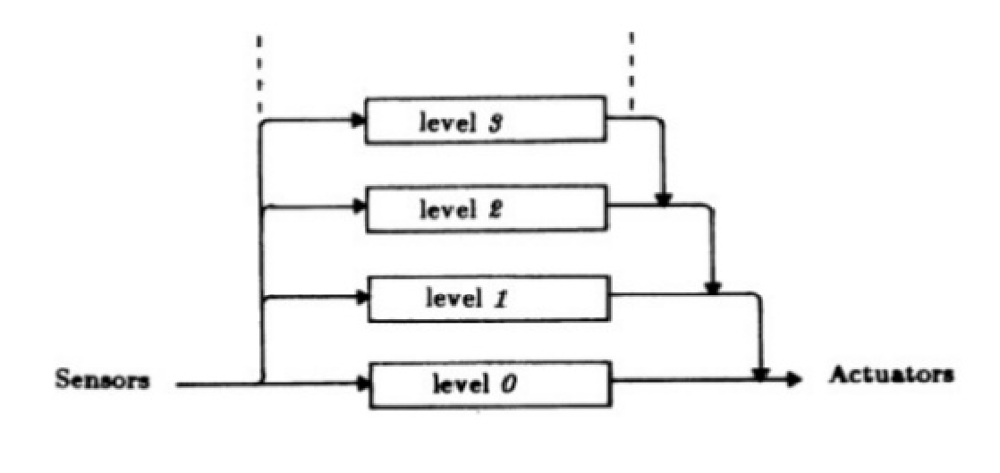

# Expanding the motor system

Once creatures develop basic approach-avoidance responses to different sensory stimuli (like those in Braitenberg vehicles), the next question is how to organize these behaviors. If all behaviors are treated equally, conflicts may arise. For example, a creature that find light attractive might get stuck on an obstacle simply because the obstacale avoidance loop, might not be able to overcome its desired for light, eventually leading the creature to get stuck.

This problem points to the need for a hierarchical motor system—one where simpler behaviors can be overridden or coordinated by more complex ones. Charles Sherrington, in his studies of reflex loops, was one of the first suggesting that motor systems are likely organized in this way, allowing more complex behaviors to emerge from simpler ones. However, it wasn’t until nearly a century later that Rodney Brooks conceptualized this idea with his subsumption architecture.

## Brooks' Subsumption Architecture

    

Figure1: caption for Braitenberg1

Brooks’ subsumption architecture organizes behaviors into layers, where each layer corresponds to a specific motor action (e.g., obstacle avoidance, light attraction). Lower-level behaviors can take control if needed, but their activity can be overriden by  higher-level behaviors. For example, a robot may prioritize obstacle avoidance over moving toward light, ensuring adaptive, real-time responses to environmental changes. This layered approach allows complex behaviors to emerge from simple, reactive processes, providing the flexibility to respond appropriately to diverse situations.

## Subsumption architecture in Drosophila larvae

    

Figure2: Drosophila backward locomotion

A clear example of subsumption architecture in biological systems is found in the study by Carreira-Rosario et al. (2018), which explores how mooncrawler descending neurons (MDNs) in Drosophila larvae facilitate the smooth transition between antagonistic behaviors like forward and backward locomotion. The MDNs act as "command-like" neurons that coordinate this switch by both activating a backward-active premotor neuron (A18b) and inhibiting a forward-specific premotor neuron (A27h) through the Pair1 descending interneuron. This dual action prevents simultaneous forward and backward movement, enabling efficient locomotor control. Importantly, the study demonstrates how these neurons' actions are layered: MDNs activate the backward movement pathway while simultaneously inhibiting the forward pathway, which mirrors the layered, behavior-suppressing and behavior-promoting actions of subsumption architecture. This coordination of antagonistic motor behaviors via interconnected neural circuits allows the larvae to navigate complex environments, much as subsumption architecture enables robots to seamlessly transition between behaviors in response to shifting environmental conditions.

## The advantage of having independent mechanisms to drive the animal forward and backward. Inhibition

## Braitenbergs meet the subsumption architecture

    

 

    

Figure2: caption for Braitenbergs2a and Braitenbergs2b

### References
Carreira-Rosario A, Zarin AA, Clark MQ, Manning L, Fetter RD, Cardona A, and Doe CQ (2018). MDN brain descending neurons coordinately activate backward and inhibit forward locomotion eLife 7:e38554. https://doi.org/
    
