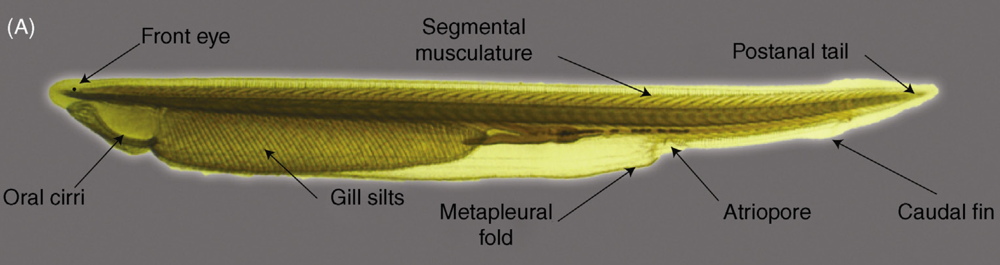
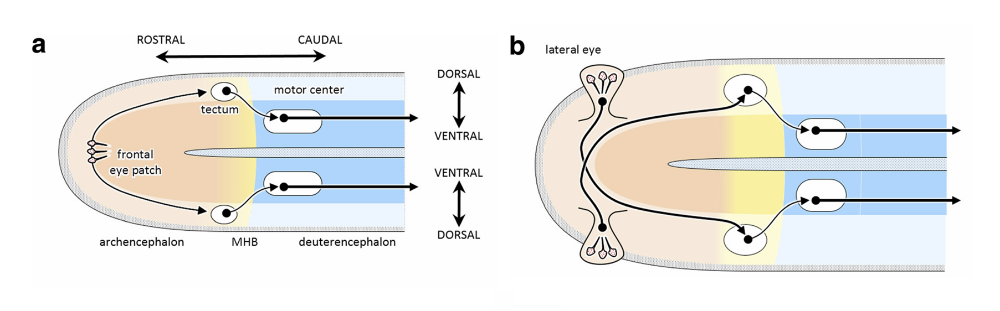

# Expanding the visual system

The transition from **Vehicle 1** to **Vehicles 2** and **3** offers a compelling framework for understanding the evolution of visually guided behavior in early chordates. 

The amphioxus (lancelet) frontal eye is a primitive light-sensitive spot, not a true eye, located at the anterior tip of the cerebral vesicle, but it's not homologous to a vertebrate eye with a lens or cornea. The notochord is a persistent, flexible rod that extends through the entire body, including the head, and functions as the primary skeletal support. 

    

Figure1: caption for Braitenberg1

 The first chordate nervous systems consisted of a simple hypothalamic region regulating basic physiology and a hindbrain–spinal complex driving rhythmic swimming. Early photoreceptors functioned like Vehicle 1, linking light detection directly to motion. As circuits diversified, they began supporting escape responses akin to Vehicle 2a, where light reduction triggered avoidance. With bilateral photoreceptive patches and contralateral wiring—echoing Vehicle 2b—organisms gained directional control, turning toward or away from stimuli.

    

Figure1: caption for Braitenberg1

The subsequent emergence of paired eyes and retino-tectal pathways parallels the inhibitory sophistication of Vehicles 3a and 3b, enabling both approach and avoidance depending on context. In lampreys and early vertebrates, distinct tectal zones mediated these responses through lateral inhibition, ensuring that one behavioral mode could suppress the other when necessary. Thus, the evolutionary transition from scattered photoreceptors to image-forming eyes recapitulates Braitenberg’s conceptual sequence: simple excitation gives rise to orientation, and inhibition adds adaptive choice—together forming the neural foundations of purposeful vision and action.

    
    

Figure2: caption for Braitenbergs2a and Braitenbergs2b

### References
Cisek P

Feng Y, Li J, and Xu A (2016). Amphioxus as a Model for Understanding the Evolution of Vertebrates. In Xu A,
Amphioxus Immunity, Academic Press, 2016, pp:1-13
