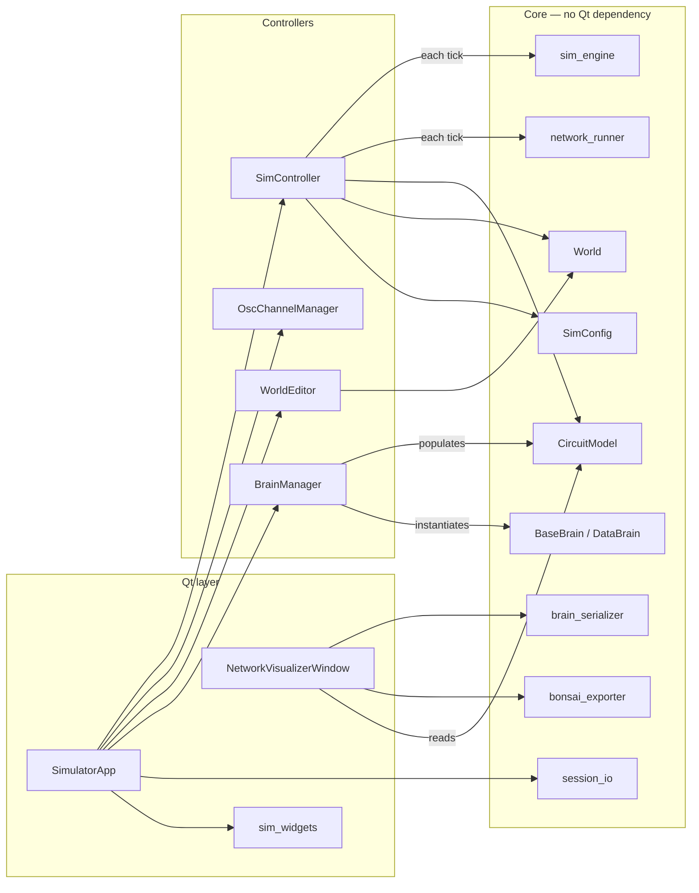
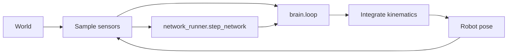
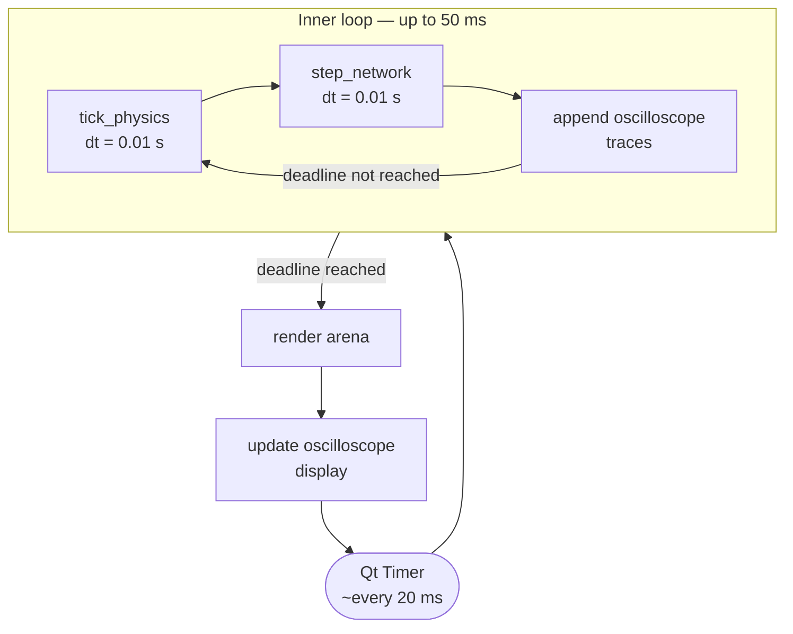
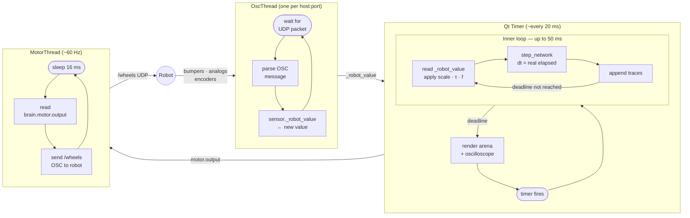
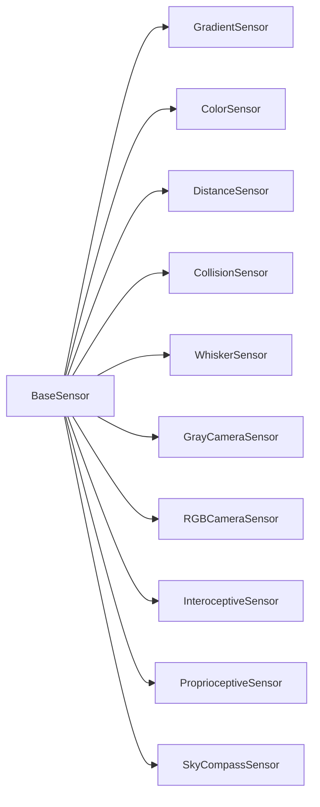
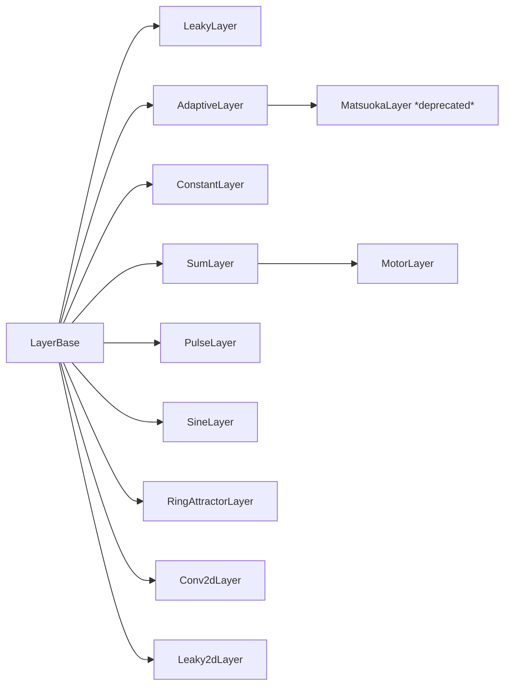

# Architecture & Timing

The simulator is split into classes with distinct responsibilities. Every component in the *Core* layer has no Qt dependency and can be used from scripts or tests.

---

## Component overview



---

## Per-tick data flow



---

## Timing

The simulator separates **physics/network stepping** from **display rendering** — and in real-robot mode, also from **sensor I/O** and **motor output**.

### Simulation mode



Because the inner loop runs many steps before handing control back to the GUI, the **network executes at ~200+ steps/s** while the **display updates at ~14 Hz**.

| Component | Typical rate |
|---|---|
| Qt timer fires | ~14 Hz |
| `tick_physics` + `step_network` | ~230 Hz |
| Arena repaint | ~14 Hz |
| Oscilloscope update | ~14 Hz |

### Real-robot mode

Three concurrent activities share the process, each at its own rate.



| Thread | Rate | Driven by |
|---|---|---|
| OscThread | robot send rate (~60 Hz) | incoming UDP packets |
| Qt loop — network | ~230 Hz | 50 ms deadline |
| MotorThread | ~60 Hz | fixed 16 ms sleep |

!!! note "Thread safety"
    The simulator relies on Python's GIL rather than explicit locks. `OscThread` writes `sensor._robot_value`; the Qt thread reads it — a stale read is at most one robot transmission cycle old, which is harmless. `MotorThread` reads `brain.motor.output` every 16 ms; the worst case is one network step stale, well within motor latency tolerance.

---

## Classes

### `SimulatorApp` — thin orchestrator

`LBPSimulator.py`

`SimulatorApp` is the Qt main window. Its job is layout and wiring: it creates the panels, instantiates the controller objects, and routes Qt signals to them. It contains no simulation logic, physics state, or save/load code — those are all delegated.

---

### `SimController` — simulation loop

`sim_controller.py`

`SimController` owns everything that changes every tick: the `QTimer`, the robot's current position and heading, the running/paused flag, speed multiplier, real-time mode, manual-control motor override, the active task, and the `SimLogger`. It calls `sim_engine.tick_physics` and `network_runner.step_network` each frame and dispatches display updates to `ArenaWidget` and `OscChannelManager`.

---

### `OscChannelManager` — oscilloscope

`osc_controller.py`

`OscChannelManager` owns the set of tracked oscilloscope channels, their colours, per-channel multiplier spinboxes, and trace ring-buffers. It discovers which channels the active brain and circuit expose and rebuilds the plot layout when the brain changes.

---

### `WorldEditor` — arena editing

`world_editor.py`

`WorldEditor` owns the draw-mode state machine: which mode is active (gradient patch, solid object, wall, robot drag), which palette entry is selected, and any in-progress polygon. It implements the arena mouse handlers that mutate `World` and request a display refresh.

---

### `session_io` — save / load

`session_io.py`

`session_io` provides two pure functions — `save_session` and `load_session` — that serialise and deserialise the full simulator state (brain params, world patches, sim config, oscilloscope multipliers) as JSON.

---

### `brain_serializer` — code generation

`brain_serializer.py`

`brain_serializer` contains pure functions for writing brain `.py` files from a live circuit. Keeping it separate from the visualiser means the same code-generation logic is available from tests or command-line tools.

---

### `bonsai_exporter` — Bonsai XML export

`bonsai_exporter.py`

Converts a `CircuitModel` into LBP.Torch Bonsai XML that can be pasted directly into a Bonsai workflow. It traces only the layers reachable from the motor output, maps sensor dynamics and activations to their Bonsai equivalents, and generates the input-preparation, graph-construction, and forward-pass branches.

---

### `network_runner` — neural forward pass

`network_runner.py`

`network_runner.step_network` is the neural forward pass extracted from `BaseBrain`. It reads `layers`, `connections`, and `sensors` from the brain instance, propagates signals through the weight matrices, applies neuromodulation, and mutates `layer.output` in place.

---

### `sim_engine` — pure physics step

`sim_engine.py`

A module of pure functions. The main entry point takes the current robot state, calls all sensors, runs the brain's `loop()`, and integrates the differential-drive kinematics one timestep forward. No Qt imports.

The `MuJoCoEngine` class follows the same interface but delegates integration to a MuJoCo model, so the brain and sensor code runs unchanged whether the physics is custom or MuJoCo.

---

### `World` — the physical environment

`world.py`

`World` owns everything that is not the robot: gradient patches, solid obstacles, polygon walls, the arena boundary, and the sky (for the compass sensor). It is a plain data container — it does not know about rendering or physics.

---

### `SimConfig` — shared simulation parameters

`sim_config.py`

`SimConfig` holds knobs that are global to a session: timestep `dt`, arena size, robot body radius, maximum speed, and similar constants. It is a `BaseConfig` subclass, so any `Param` declared on it automatically generates a GUI slider.

| Parameter | Default | Description |
|---|---|---|
| `dt` | 0.01 s | Simulation timestep |
| `arena_scale` | 5.0 m | Arena half-width |
| `motor_gain` | 1.0 | Motor speed multiplier |
| `body_radius` | 0.2 m | Robot body radius |
| `sense_radius` | 1.0 m | Sensor ray length |
| `init_x`, `init_y` | 0, 0 | Robot start position |
| `stim_radius` | 0.5 m | Radius of new gradient patches |
| `toggle_stim` | on | Show / hide stimulus patches |
| `fixate_robot` | off | Freeze robot position |

---

### `BaseSensor` / sensor subclasses — transduction

`sensors.py`

`BaseSensor` defines the contract every sensor must satisfy: a `sample(x, y, theta, world, sim_cfg)` method that maps the robot's current pose and world state to a numpy array. The result is stored on the brain as `brain.<sensor.name>` so `loop()` can read it by name.

All sensors share an optional output pipeline: Gaussian noise → asymmetric leaky dynamics (`tau_rise` / `tau_decay`) → activation function → differential mode.



| Class | What it detects |
|---|---|
| `GradientSensor` | Soft circular gradient patches; casts n rays in a fan, returns field intensity per ray |
| `ColorSensor` | Solid coloured circular objects via ray-circle intersection |
| `DistanceSensor` | Normalised proximity to the nearest wall or obstacle (1 = touching, 0 = at max range) |
| `CollisionSensor` | Contact within n arc sectors around the robot perimeter (1 = contact, 0 = clear) |
| `WhiskerSensor` | Tactile whisker: bending proportion from 0 (no contact) to 1 (contact at base) |
| `GrayCameraSensor` | Wide-angle raycasted image (luminance); output shape `(H × W,)` |
| `RGBCameraSensor` | Wide-angle raycasted image (colour, CHW); output shape `(3 × H × W,)` |
| `InteroceptiveSensor` | Internal gut state: integrates gradient exposure at the mouth over time (scalar) |
| `ProprioceptiveSensor` | Joint angle or angular velocity of articulated body segments |
| `SkyCompassSensor` | Polarised-light sky compass (DRA); encodes heading relative to sun direction |

Both camera sensors support `lateralized=True`, which splits the image at the horizontal midline into `sensor_L` and `sensor_R` halves, each feeding its own `Conv2dLayer`.

---

### `LayerBase` / neuron layer subclasses — neural dynamics

`neurons.py`

`LayerBase` is a thin `nn.Module` mixin that adds display and neuromodulation attributes shared by every layer type (`name`, `color`, `group`, `modulators`, …). All concrete layer classes inherit from it and register themselves in `LayerBase._registry` for JSON deserialisation.



| Class | Dynamics |
|---|---|
| `LeakyLayer` | First-order low-pass filter (`dx/dt = (u−x)/τ`); asymmetric rise/decay, derivative mode, OU noise |
| `AdaptiveLayer` | Leaky integrator with spike-frequency adaptation; `w > 0` + `n=2` gives half-centre oscillation |
| `MatsuokaLayer` | *(deprecated — use `AdaptiveLayer`)* Thin wrapper kept for loading old JSON networks |
| `ConstantLayer` | Fixed output; tonic drive source, ignores incoming connections |
| `SumLayer` | Instantaneous weighted sum; no dynamics, no memory |
| `MotorLayer` | `SumLayer` + robot actuation; sends output via OSC to `robot_address` in real-robot mode |
| `PulseLayer` | Plateau-potential neurons with sustained activation and inhibitory reset |
| `SineLayer` | Autonomous sine-wave generator; ignores incoming connections |
| `RingAttractorLayer` | N leaky neurons on a ring; recurrent connectivity via a self-connection (Mexican-hat kernel) |
| `Conv2dLayer` | 2-D convolution over camera input; per-filter global pooling; optional leaky dynamics and adaptation |
| `Leaky2dLayer` | Pixel-wise leaky integrator that preserves full spatial image structure; feeds into `Conv2dLayer` |
| `AccumulatorLayer` | (no description) |
| `DeltaLayer` | (no description) |
| `Reichardt2dLayer` | (no description) |
| `TDLayer` | (no description) |
| `ThreeFactorLayer` | (no description) |

---

### `CircuitModel` — shared circuit state

`circuit_model.py`

`CircuitModel` is a plain container holding the four lists that define the active circuit: `sensors`, `layers`, `connections`, and `bodies`/`joints`. `connections` is a list of `Connection` dataclass objects (`src`, `tgt`, `W`, `learning`, `lr`). It is owned by `SimulatorApp` and shared by reference with `SimController`, `NetworkVisualizerWindow`, and `BrainManager`.

---

### `BaseBrain` / `DataBrain` — the control law

`brain_base.py`

`BaseBrain` is the base class every brain plugin must inherit. Class-level `Param` and `ChoiceParam` descriptors declare tunable knobs that `BaseConfig.__init__` copies to instance attributes; the GUI reads the metadata to build sliders automatically.

`DataBrain` extends `BaseBrain` for brains loaded from a JSON network file. It rebuilds `layers`, `connections`, and `sensors` from the serialised description so the brain file contains only data — no Python logic.

---

### `BrainManager` — plugin loading and circuit wiring

`brain_manager.py`

`BrainManager` discovers Python files in `brains/`, imports them, finds the class that inherits `BaseBrain`, instantiates it, and populates the `CircuitModel`. It also synthesises the motor `SumLayer` for each joint and wires `ProprioceptiveSensor` instances onto articulated bodies automatically.

---

### `RigidBody` / `Joint` — articulated robot body

`rigid_body.py`

`RigidBody` is a named disk with a radius. The robot always has a root body (the drive disk). Extra bodies can be attached via `Joint`s — for example, a passive or motor-driven segment that carries its own sensors.

---

### `RobotDriver` — real-robot I/O

`robot_driver.py`

`RobotDriver` isolates all real-robot communication. It manages one background thread per unique `robot_address` string found among the active sensors. Thread type is determined by sensor class: `CameraThread` for camera sensors (UDP JPEG client), `OscThread` for everything else (UDP OSC server). Each thread writes decoded data into `sensor._robot_value` so the simulation loop can read it without touching any sockets.

See [Running on the real robot](real-robot.md) for the full usage guide.

---

## File map

```
LBPSimulator.py   main window (SimulatorApp)
sim_controller.py         simulation loop
sim_engine.py             pure physics step (also MuJoCoEngine)
sim_engine_mujoco.py      MuJoCo physics bridge
network_runner.py         neural forward pass
neurons.py                all layer classes + DynamicsBase
sensors.py                all sensor classes + SENSOR_REGISTRY
circuit_model.py          CircuitModel, Connection
brain_base.py             BaseBrain, DataBrain, Param, ChoiceParam
brain_manager.py          brain discovery, loading, circuit wiring
brain_serializer.py       JSON ↔ circuit serialisation
bonsai_exporter.py        CircuitModel → LBP.Torch Bonsai XML
world.py                  World — patches, objects, walls, sky
world_editor.py           arena draw-mode state machine
rigid_body.py             RigidBody, Joint
osc_controller.py         OscChannelManager (oscilloscope)
session_io.py             save/load session JSON
robot_driver.py           real-robot OSC + camera threads
sim_config.py             SimConfig (global simulation parameters)
sim_widgets.py            reusable Qt widgets
sim_constants.py          shared numeric constants
trajectory_viz.py         post-run trajectory visualiser
export_network_svg.py     export network graph as SVG
brains/                   hot-pluggable brain plugins
networks/                 saved network JSON files
tasks/                    pluggable world dynamics (BaseTask subclasses)
configs/                  saved session configs
```
