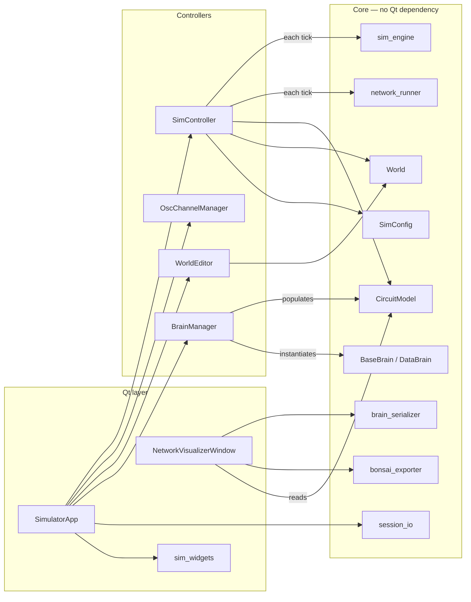
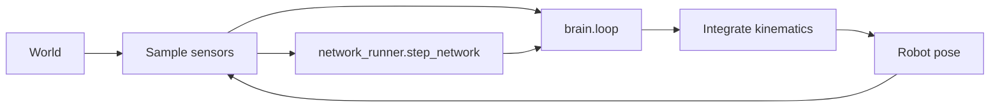
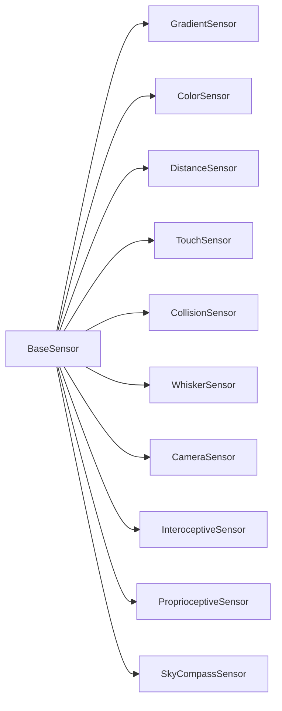
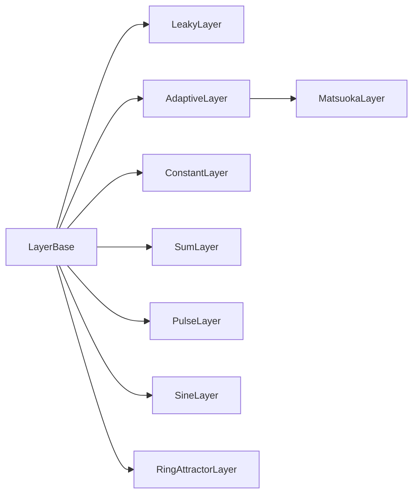
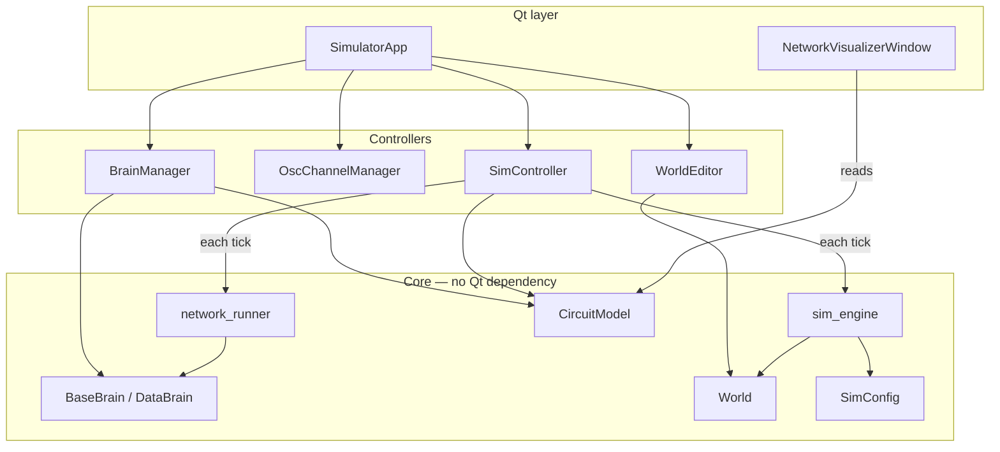

# Simulator Architecture — Main Classes

The simulator is split into a set of classes with distinct responsibilities. Understanding why each class exists helps when extending the system or debugging unexpected behaviour.

## Component overview

`SimulatorApp` is a thin orchestrator. The bulk of the work lives in dedicated classes that it wires together. Every component in the *Core* layer has no Qt dependency and can be used from scripts or tests.

---

## Per-tick data flow

Each tick is driven by `SimController`. The physics and neural forward pass are pure functions with no Qt dependency.

---

## `SimulatorApp` — thin orchestrator

`BraitenbergSimulator.py`

`SimulatorApp` is the Qt main window. Its job is layout and wiring: it creates the panels, instantiates the controller objects, and routes Qt signals to them. It no longer contains simulation logic, physics state, or save/load code — those are all delegated.

This reduction (from ~2 000 lines to ~1 200) was the goal of the restructuring. Adding a new feature no longer means editing a monolith.

---

## `SimController` — simulation loop

`sim_controller.py`

`SimController` owns everything that changes every tick: the `QTimer`, the robot's current position and heading, the running/paused flag, speed multiplier, real-time mode, manual-control motor override, the active task, and the `SimLogger`. It calls `sim_engine.tick_physics` and `network_runner.step_network` each frame and dispatches display updates to `ArenaWidget` and `OscChannelManager`.

Extracting this from `SimulatorApp` means the simulation loop is testable without a Qt main window.

---

## `OscChannelManager` — oscilloscope

`osc_controller.py`

`OscChannelManager` owns the set of tracked oscilloscope channels, their colours, per-channel multiplier spinboxes, and trace ring-buffers. It discovers which channels the active brain and circuit expose, rebuilds the plot layout when the brain changes, and updates the curves each tick.

Previously this logic was scattered across `SimulatorApp`. Isolating it means oscilloscope behaviour can be changed without touching the simulation loop.

---

## `WorldEditor` — arena editing

`world_editor.py`

`WorldEditor` owns the draw-mode state machine: which mode is active (gradient patch, solid object, wall, robot drag), which palette entry is selected, and any in-progress polygon. It implements the arena mouse handlers that mutate `World` and request a display refresh. It has no dependency on the Qt main window or the simulation loop.

---

## `session_io` — save / load

`session_io.py`

`session_io` provides two pure functions — `save_session` and `load_session` — that serialise and deserialise the full simulator state (brain params, world patches, sim config, oscilloscope multipliers) as JSON. Having no Qt dependency means session files can be read and written from scripts.

---

## `brain_serializer` — code generation

`brain_serializer.py`

`brain_serializer` contains pure functions for writing brain `.py` files from a live circuit. When you edit a network in `NetworkVisualizerWindow` and click *Save as brain*, this module generates the Python source. Keeping it separate from the visualiser means the same code-generation logic is available from tests or command-line tools.

---

## `bonsai_exporter` — Bonsai XML export

`bonsai_exporter.py`

`bonsai_exporter` converts a `CircuitModel` into LBP.Torch Bonsai XML that can be pasted directly into a Bonsai workflow. It traces only the layers reachable from the motor output, maps sensor dynamics and activations to their Bonsai equivalents, and generates the input-preparation, graph-construction, and forward-pass branches. Pure function — no Qt.

---

## `network_runner` — neural forward pass

`network_runner.py`

`network_runner.step_network` is the neural forward pass extracted from `BaseBrain`. It reads `layers`, `connections`, and `sensors` from the brain instance, propagates signals through the weight matrices, applies neuromodulation, and mutates `layer.output` in place. Extracting it means it can be tested independently and imported without subclassing `BaseBrain`.

---

## `sim_widgets` — Qt widget helpers

`sim_widgets.py`

`sim_widgets` collects reusable Qt components with no simulation logic: `OscilloscopeWidget` (the pyqtgraph plot), `ControlPanel` (scrollable parameter panel), `MonetarySpinBox` (stepped scale spinbox for oscilloscope gain), and `_ManualKeyFilter` (WASD key tracker). These were previously defined inline in `BraitenbergSimulator.py`.

---

## `World` — the physical environment

`world.py`

`World` owns everything that is not the robot: gradient patches, solid obstacles, walls, the arena boundary, and the sky (for the compass sensor). It is a plain data container — it does not know about rendering or physics. The physics step reads from it; `WorldEditor` writes to it.

---

## `SimConfig` — shared simulation parameters

`sim_config.py`

`SimConfig` holds knobs that are global to a session: timestep `dt`, arena size, robot body radius, maximum speed, and similar constants. Because many classes (sensors, brain, physics step) all need `dt` and `arena_scale`, centralising them in one object avoids threading the same values through every call signature.

`SimConfig` is a `BaseConfig` subclass, so any `Param` declared on it automatically generates a GUI slider.

---

## `BaseSensor` / sensor subclasses — transduction

`sensors.py`

`BaseSensor` defines the contract every sensor must satisfy: a `sample(x, y, theta, world, sim_cfg)` method that maps the robot's current pose and the world state to a numpy array. The result is stored on the brain as `brain.<sensor.name>` so `loop()` can read it by name.

| Class | What it detects |
|---|---|
| `GradientSensor` | Proximity to circular gradient patches; casts rays, reads field intensity |
| `ColorSensor` | Presence of solid objects by colour; ray-casts to objects |
| `DistanceSensor` | Distance to the nearest wall or obstacle |
| `TouchSensor` | Binary contact with an object |
| `CollisionSensor` | Collision force from an obstacle, integrated over contact angle |
| `WhiskerSensor` | Point-contact detector at a fixed forward offset |
| `CameraSensor` | Wide-angle ray-cast returning colour per ray (simplified retina) |
| `InteroceptiveSensor` | Internal body state: battery level, motor effort |
| `ProprioceptiveSensor` | Joint angle and velocity of articulated body segments |
| `SkyCompassSensor` | Polarised-light compass direction (sky `e`-vector) |

The base class handles optional leaky dynamics (`tau_rise`, `tau_decay`) and an activation function, so sensor outputs can be smoothed or rectified without changing the sensor subclass.

Sensors are declared as class attributes on a brain, not passed in from outside. This keeps the brain file self-contained: everything the robot can perceive is listed in one place.

---

## `BaseBrain` / `DataBrain` — the control law

`brain_base.py`

`BaseBrain` is the base class every brain plugin must inherit. It has two responsibilities:

1. **Plugin metadata** — class-level `Param` and `ChoiceParam` descriptors declare tunable knobs. `BaseConfig.__init__` copies the defaults to instance attributes, and the GUI reads the metadata to build sliders automatically.

2. **Delegating the forward pass** — `BaseBrain` delegates to `network_runner.step_network` rather than running the forward pass itself. Brain authors can either write `loop(dt)` in pure Python (ignoring layers), or declare a network and let the runner do the forward pass.

`DataBrain` extends `BaseBrain` for brains loaded from a JSON network file. It rebuilds the `layers`, `connections`, and `sensors` lists from the serialised description, so the brain file itself contains only data — no Python logic.

---

## `Param` / `ChoiceParam` — declarative GUI knobs

`brain_base.py`

`Param` is a descriptor that records a default value, range, step size, and label. Declaring one as a class attribute on a brain or `SimConfig` is enough for the GUI to create a live-editable slider for it. `ChoiceParam` does the same for string-valued options, rendered as a drop-down.

The key design choice: parameters are *class-level*, not instance-level. This means multiple brain instances share the same metadata, and the GUI can introspect the class without instantiating it.

---

## `LayerBase` / neuron layer subclasses — neural dynamics

`neurons.py`

`LayerBase` is a thin `nn.Module` mixin that adds the seven display and neuromodulation attributes shared by every layer type (`name`, `color`, `group`, `modulators`, …). All concrete layer classes inherit from it and register themselves in `LayerBase._registry` for JSON deserialisation.

| Class | Dynamics |
|---|---|
| `LeakyLayer` | Leaky integrator (`dx/dt = (u−x)/tau`); optional asymmetric rise/decay, derivative mode, OU noise |
| `AdaptiveLayer` | Leaky integrator with spike-rate adaptation; fires on input onset |
| `MatsuokaLayer` | Matsuoka half-centre oscillator; generates rhythmic alternation between two neuron groups |
| `ConstantLayer` | Fixed output; used as a bias or tonic drive |
| `SumLayer` | Weighted sum of its inputs with no dynamics; used for motor output |
| `PulseLayer` | Emits a fixed-duration pulse on a rising input edge |
| `SineLayer` | Autonomous sine-wave generator; no input required |
| `RingAttractorLayer` | Discrete ring of leaky neurons with recurrent lateral inhibition; implements a bump attractor |

Keeping dynamics in the layer means the brain's `connections` list is just weight matrices — the same list format drives both the forward pass in `network_runner` and the visualisation in `NetworkVisualizerWindow`.

---

## `CircuitModel` — shared circuit state

`circuit_model.py`

`CircuitModel` is a plain container (`__slots__`) holding the four lists that define the active circuit: `sensors`, `layers`, `connections`, and `bodies`/`joints`. `connections` is a list of `Connection` dataclass objects (fields: `src`, `tgt`, `W`, `learning`, `lr`) — tuples written in brain `.py` files are normalised to `Connection` at load time. It is owned by `SimulatorApp` and shared by reference with `SimController`, `NetworkVisualizerWindow`, and `BrainManager`.

`CircuitModel` gives all components a clean shared boundary — `BrainManager` writes, everything else reads — without any component needing to know about the others' internals.

---

## `RigidBody` / `Joint` — articulated robot body

`rigid_body.py`

`RigidBody` is a named disk with a radius. The robot always has a root body (the drive disk). Extra bodies can be attached via `Joint`s — for example, a passive or motor-driven segment that carries its own sensors.

`Joint` stores attachment geometry (distance and angle from the parent), joint angle limits, and a pointer to the `SumLayer` that drives it. This lets articulated robots be described purely in data and reconstructed from JSON, without any code changes in the physics engine.

---

## `BrainManager` — plugin loading and circuit wiring

`brain_manager.py`

`BrainManager` handles everything about getting a brain from a file on disk into a running circuit. It discovers Python files in `brains/`, imports them, finds the class that inherits `BaseBrain`, instantiates it, and populates the `CircuitModel`. It also synthesises the motor `SumLayer` for each joint and wires `ProprioceptiveSensor` instances onto articulated bodies automatically — topology the brain author should not have to manage.

Isolating this logic from `SimulatorApp` means the brain hot-reload path (edit file, click Reload) can call `BrainManager` methods without touching the GUI.

---

## `RobotDriver` — real-robot I/O

`robot_driver.py`

`RobotDriver` isolates all real-robot communication from the rest of the simulator. It manages one background thread per unique `robot_address` string found among the active sensors. Thread type is determined by sensor class: `CameraThread` for camera sensors (UDP JPEG client), `OscThread` for everything else (UDP OSC server). Each thread writes decoded data into `sensor._robot_value` so the simulation loop can read it without touching any sockets.

`SimController` holds one `RobotDriver` instance and interacts with it through three calls: `start`, `stop`, and `send_wheels`. Nothing else in the codebase imports `robot_driver`.

See [Running on the real robot](real-robot.md) for the full usage guide.

---

## `sim_engine` — pure physics step

`sim_engine.py`

`sim_engine` is a module of pure functions. The main entry point takes the current robot state, calls all sensors, runs the brain's `loop()`, and integrates the differential-drive kinematics one timestep forward. It has no imports from Qt or any display code. `SimController` calls it every tick.

The `MuJoCoEngine` class follows the same interface but delegates integration to a MuJoCo model, so the brain and sensor code runs unchanged whether the physics is custom or MuJoCo.

---

## How they fit together

The one-way dependency from `sim_engine` and `network_runner` to `World`/`sensors`/`brain` — with no Qt import in those files — is what lets you drive a simulation headlessly from a script.
