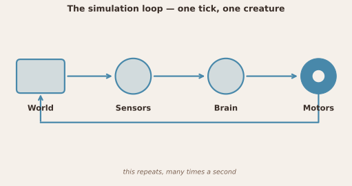
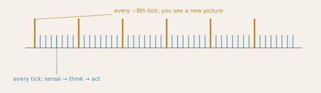
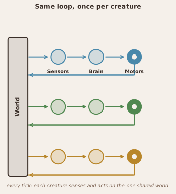
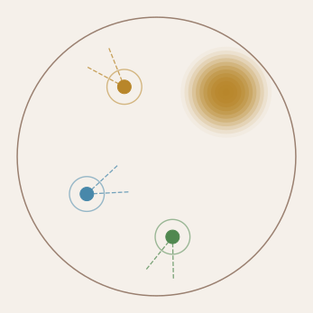
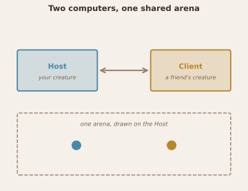
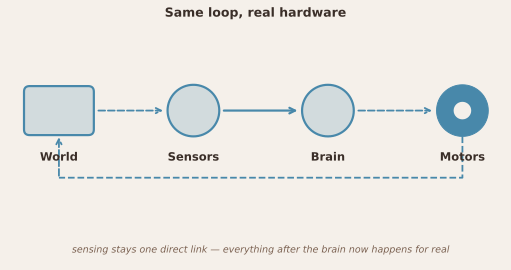

# Architecture

This page is a tour of how the simulator works — no programming background assumed. If you've already read [Coding Brains](coding-brains.md) or [Wiring Brains](wiring-brains.md), the "loop" below is the very thing you were building. If you want file names and class responsibilities instead, see the [Class Reference](reference.md).

It's organized in the order complexity is usually added: one creature, then several creatures at once, then a real robot instead of a simulated body. The same loop diagram reappears in each section with exactly one thing changed, because it really is the same loop underneath in all three cases.

---

## Single agent

### The simulation loop



Every robot in the simulator runs this loop, over and over, many times a second — this is what one **tick** of the simulation is:

1. **Sense** — read whatever the body's sensors can detect right now: light, a nearby wall, another creature's touch, its own internal state.
2. **Think** — feed those readings into the creature's "brain." This can be a few lines of Python you wrote yourself, or a small network of neuron-like units you wired up visually — the loop doesn't care which; both end up as a set of motor commands.
3. **Act** — send those commands to the motors, which move the body.

Moving changes what the sensors will read on the *next* pass through the loop, which is exactly the idea behind a Braitenberg vehicle: behavior emerges from a fixed loop between sensing and acting, not from a plan.

### Order inside a network { #network-order }

In a network brain, all sensors are read first, then the layers update **one after another, in the order they appear in the network file** (the order they were created). A layer reads each of its sources as it is at that moment:

- **Sensor → layer**: always this tick's reading — no delay.
- **Layer → layer, source earlier in the list**: the source has already updated, so the target gets this tick's value — no delay.
- **Layer → layer, source later in the list**: the source hasn't updated yet, so the target gets the previous tick's value — **one tick of delay**. This is what makes feedback loops work, but it also applies to plain feedforward connections. The `motor` layer is usually created first, so everything feeding it typically arrives one tick (0.01 s at the default time step) late.

Every saved network was built and tuned with this rule, so it is kept as it is rather than reordered automatically.

### How fast does the loop run?



The loop above runs far more often than the screen redraws. Not unlike how your own eyes deliver only a handful of distinct pictures per second even though the neurons behind them are firing much faster, the simulator can run the loop hundreds of times per second while only updating what you actually *see* about a dozen times per second. You won't notice this as a difference in behavior — motion and plots still look smooth — only that "how fast the world changes" and "how fast the picture updates" are two separate numbers. The exact rates, and how real-robot mode adds its own timing on top, are in the [Class Reference](reference.md#timing).

---

## Multiple agents

### Same loop, many creatures



You are not limited to one robot. The simulator can run several creatures at once, and nothing about the loop itself changes — it's simply run once per creature, every tick. A few consequences of that:

- Creatures can be **grouped** if they share the same brain — tweak one parameter and every member of the group updates.
- Clicking a creature **selects** it: its own sensor traces show up on the oscilloscope, without pausing anyone else.
- All of them share the same arena, so they can sense the same gradients, walls, and objects — and, in the full 3-D physics engine, bump into each other.



### Two computers, one shared arena



Multiple creatures don't have to run on the same computer. Two copies of the simulator can connect to each other over a regular network: one becomes the **Host** (it owns the shared arena you see on screen), and others connect as **Clients**, each bringing their own creature and running their own brain on their own computer. Only sensor readings and motor decisions cross the wire — neither computer ever runs the other's brain code. It's the same "many creatures, one arena" idea above, just with the creatures' brains spread across machines instead of all running locally.

---

## Real robot

### Same loop, real hardware



Swap the simulated body for a physical one and the loop doesn't change shape — only how much of it is still just software. Sensor data reaching the brain stays a single, solid, direct link (same message format as in simulation). Everything downstream of the brain — the motor command reaching the robot, the robot acting in the real world, and the world producing the next thing to sense — now happens for real, out in physical hardware, shown dashed. That's why you can develop and tune a brain entirely in simulation and flip a switch later to drive real hardware without touching the brain itself.

This is unrelated to the two-computers case above — one is about *where a creature's brain runs*, the other is about *what body a creature's brain controls*. Either can happen with a single agent or with several running at once.

In code, this is literally one loop: the simulator, a real robot and a network client all run the brain through the same "think" and "motors" steps; only where sensor readings come from and where motor commands go differ.

---

## Running without the window

The simulated world doesn't need the window. `Simulation` (`simulation.py`) holds the arena, the creatures and the physics engine, and advances them one step at a time; the app just drives it from a timer and draws what happens. That means a saved session can also run **headless** — faster than real time, with no screen — for long or repeated experiments:

```bash
# from simulation/2d/
python src/headless.py "configs/Tutorials/T03 - ColisionSession.json" --seconds 60 --seed 1 --out run.csv
```

The CSV has one row per creature per step (position, motor commands, sensor readings). With the same `--seed`, a run is exactly repeatable, and it gives the same result as running the session in the app. Every creature is driven by its own brain — there is no keyboard or network in a headless run. See [Headless Runs](headless.md) for options, the CSV format and scripting experiments in Python.

---

## Views on the same world

Several windows all look at the same arena and circuit from different angles:

| Window | What it shows |
|---|---|
| Arena (main view) | Top-down scene: creatures, trails, gradients, objects, walls |
| "Top view" toggle | A rendered overhead image from the full 3-D physics engine, laid over the same arena |
| "Show 3D" button | A separate, interactive 3-D window you can rotate and walk around in |
| Network visualizer | The circuit diagram you edit by hand — sensors and neurons as nodes, connections as arcs |
| Network visualizer's 3-D toggle | A rotatable 3-D rendering of *that same circuit diagram* — it is not a view of the robot's body |

**Who simulates what.** MuJoCo is always running — there is no switch to turn it off. The two subsystems drive different aspects of the same simulation:

| Subsystem | Owns |
|---|---|
| **MuJoCo** (`sim_engine_mujoco.py`) | Body movement and collisions with walls, objects and other agents; contacts for root-mounted `CollisionSensor`s; camera images |
| **2-D fields** (`sim_engine.py`, `sensors.py`) | Patches, gradients, sky polarization, interoception, distance rays, whiskers — anything MuJoCo has no notion of |

**One simulation step** (`sim_engine.step_agents`, all agents together):

1. **Sense** — every reading describes the world at the same moment, before any brain runs: 2-D field sensors, MuJoCo contacts, and any camera whose next frame is due.
2. **Think** — each agent's `brain.loop(dt)` runs once.
3. **Motors** — one motor source per agent: keyboard, network client, or the brain's own motor layer (see `rules/motor_commands.md`). A keyboard/network command is also written into the motor layer so the visualizer and oscilloscope show what is driving the wheels.
4. **Act** — MuJoCo moves all agents together and resolves contacts.

**Cameras have their own frame rate.** Each camera sensor's `fps` parameter (default 60) sets how many frames it renders per *simulated* second, so what the brain sees doesn't depend on simulation speed or how fast your computer is. Between frames the brain keeps the last image. With `fps = 0` the camera renders as fast as the app can — once per display update, between batches of simulation steps — without holding up the other sensors.

**The display controls don't affect sensor data.**

| Control | What it actually gates |
|---|---|
| **"Top view" button** | Purely cosmetic: swaps the *arena canvas* between the plain 2-D top-down drawing and a MuJoCo overhead preview image (`render_overhead()`). Does not touch any sensor. |
| **"Show 3D" button** | Opens the separate interactive 3-D viewer window. Also does not touch any sensor. |

Camera sensors always see a MuJoCo render, even when the arena canvas shows the plain flat 2-D view — don't infer what a camera sensor is seeing from what the arena canvas looks like.

`CollisionSensor` sensors mounted on the robot's root body read MuJoCo's own contact array instead of the analytic geometry — MuJoCo already computes contacts every tick for physics regardless, so this is much cheaper (see TODO.md Performance). This works for any `radius` (literal touch or lookahead) because each sector gets its own small, real, non-physical geom built directly into the robot body, positioned and sized to match that sensor's own probe radius and arc — "is sector *i* hit" is just "does MuJoCo's contact list include this specific geom", decided by MuJoCo's actual collision engine rather than by approximating it, which is also why one large/close object correctly triggers several adjacent sectors at once. Only a sensor mounted on a non-root body (e.g. a whisker joint pair) falls back to the analytic path — check `MuJoCoEngine._mujoco_collision_eligible()` if you need to know exactly which sensors qualify. `DistanceSensor` still always runs the analytic path (unchanged, still a TODO item).

---

## Where to go next

- [Class Reference](reference.md) — every source file, its main classes, and what they own.
- [Coding Brains](coding-brains.md) — write your first brain plugin.
- [Wiring Brains](wiring-brains.md) — build a brain visually from sensors and neuron layers.
