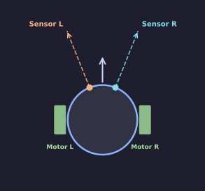
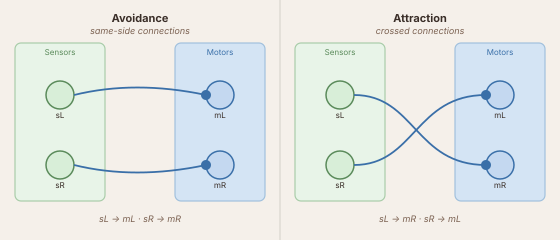

# Braitenberg Vehicles — with Code

Valentino Braitenberg's 1984 book *Vehicles* showed that a robot with two sensors and two motors can exhibit what looks like fear, aggression, curiosity, or love — depending entirely on how those sensors are wired to those motors. No memory. No planning. Just connections.

This tutorial builds two of his vehicles inside the LBP simulator, using direct Python code in `loop()`.

---

## The robot

The robot has two light sensors pointing slightly left and slightly right of forward, and two wheel-motors — one on each side.



The sensor on the **left** (`light[0]`) returns a value in `[0, 1]` that grows as the robot points toward a light patch. So does the right sensor (`light[1]`). That is all the robot knows about the world.

---

## Creating your brain file

Drop a Python file anywhere in `simulation/2d/brains/`. The simulator discovers it automatically on the next launch (or when you hit **Reload brains**).

```python title="brains/BrainLightSeeker.py"
import numpy as np
from brain_base import BaseBrain, Param
from sensors import GradientSensor


class BrainLightSeeker(BaseBrain):

    sensors = [GradientSensor(n=2, angle_spread=0.4, name='light')]
    layers  = []
    connections = []

    speed = Param(60.0, 0, 100, step=1.0, desc='Maximum motor speed')

    def setup(self):
        pass

    def loop(self, dt):
        sL, sR = self.light          # each ∈ [0, 1]
        mL = self.speed * sL
        mR = self.speed * sR
        return mL, mR                # each ∈ [-100, 100]
```

Run the simulator, open the **Brain** panel, and select `BrainLightSeeker`. Place a red gradient patch in the arena. The robot will move — but which way?

---

## Vehicle 2a — Avoidance

```
sL ──→ mL     (same side)
sR ──→ mR
```

When the light is to the **left**, `sL` is higher than `sR`. The left motor (`mL`) speeds up, so the robot steers right — **away** from the source.



The code you already have implements this. The connection pattern is: *same sensor, same motor*. In matrix language this is the identity: each sensor drives only the motor on its own side.

!!! tip "Slider"
    The `speed` Param created a slider in the GUI. Drag it while the simulation runs — the robot's behaviour changes in real time without restarting.

---

## Vehicle 2b — Attraction

Swap just two assignments:

```python hl_lines="3 4"
    def loop(self, dt):
        sL, sR = self.light
        mL = self.speed * sR    # right sensor drives LEFT motor
        mR = self.speed * sL    # left sensor drives RIGHT motor
        return mL, mR
```

Now when the light is to the left, `sL` is high — but that drives `mR`, the **right** motor. The robot steers left, toward the source. One line changed; completely opposite behaviour.

---

## Mixing the vehicles

Nothing stops you from making the weights asymmetric:

```python
    def loop(self, dt):
        sL, sR = self.light
        # Mostly avoidance, with a slight pull toward the source
        mL = self.speed * (0.8 * sL + 0.2 * sR)
        mR = self.speed * (0.2 * sL + 0.8 * sR)
        return mL, mR
```

Braitenberg called this kind of blending a vehicle with **graded connections**. The robot no longer cleanly avoids or chases — it drifts.

---

## What to try next

- Add a second gradient patch of a different colour and a second `GradientSensor` with a matching `label`. Wire the two sensors to opposite motors.
- Give the robot bumpers: `self.bumpers` is a list of `bool` values set by the simulator whenever the robot touches a wall or object.
- When the directness of the code starts to feel limiting — when you want to edit connection weights live, or add a filtering layer between sensor and motor — continue to [Braitenberg with Layers](braitenberg-neural.md).
