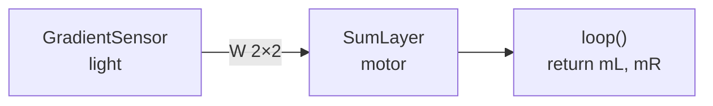
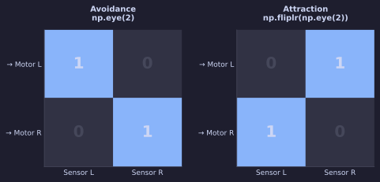
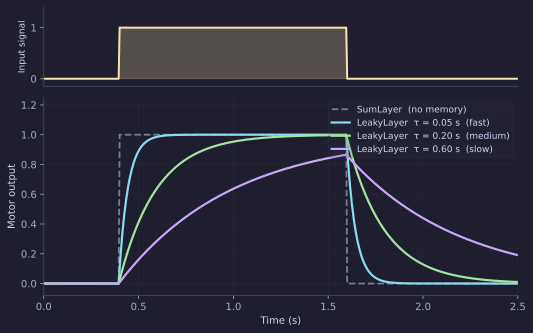

# Braitenberg Vehicles — with Neural Layers

In the [previous tutorial](braitenberg-code.md) you built a Braitenberg vehicle by writing the sensor-to-motor mapping directly in `loop()`. That works perfectly, but there is a cost: the connection strengths are constants baked into your code. Changing them means editing, saving, and reloading the file.

This tutorial implements the same two vehicles using **layers and connections**. The wiring becomes a weight matrix that the simulator can display and edit live through the network visualiser.

---

## The structure

A neural brain declares three class attributes in addition to its Params:

| Attribute | What it is |
|-----------|-----------|
| `sensors` | List of sensor objects. Each sensor's output is available in `loop()` as `self.<name>`. |
| `layers` | List of neuron layer objects. Each layer has a `.output` array updated by `step_network()`. |
| `connections` | List of `(source_name, target_name, weight_matrix)` triples. The simulator normalises these to `Connection` objects internally, so you can also write `Connection(src=…, tgt=…, W=…)` directly. |

`step_network(dt)` — called from `loop()` — reads the sensor attributes, propagates values through the connection graph, and updates every layer's `.output`.



---

## Avoidance with a SumLayer

```python title="brains/BrainNeuralLight.py"
import numpy as np
from brain_base import BaseBrain, Param
from sensors import GradientSensor
from neurons import SumLayer


class BrainNeuralLight(BaseBrain):

    sensors = [GradientSensor(n=2, angle_spread=0.4, name='light')]

    motor = SumLayer(activation='linear', name='motor', n=2)  # (1)
    layers = [motor]

    connections = [                                            # (2)
        ('light', 'motor', np.eye(2)),
    ]

    speed = Param(60.0, 0, 100, step=1.0, desc='Maximum motor speed')

    def setup(self):
        pass

    def loop(self, dt):
        self.step_network(dt)                                  # (3)
        mL, mR = self.motor.output * self.speed               # (4)
        return float(mL), float(mR)
```

1. The layer is a **class attribute** — `self.motor` gives you a reference to it from `loop()`.
2. `np.eye(2)` is the weight matrix: sensor index → motor index, same-side.
3. Propagates the sensor values through every connection and updates `motor.output`.
4. Scale the raw output (which is in `[0, 1]`) to the motor range.

This behaves identically to the code version with the same-side wiring: it avoids light.

---

## The weight matrix is the wiring diagram

The connection matrix `W` has shape `(n_target, n_source)`, i.e. `(2, 2)`. Entry `W[i, j]` is the weight from source neuron `j` to target neuron `i`.



| Matrix | Meaning |
|--------|---------|
| `np.eye(2)` | Sensor L → Motor L, Sensor R → Motor R. **Avoidance.** |
| `np.fliplr(np.eye(2))` | Sensor L → Motor R, Sensor R → Motor L. **Attraction.** |

To switch from avoidance to attraction, change one line:

```python hl_lines="2"
    connections = [
        ('light', 'motor', np.fliplr(np.eye(2))),   # crossed = attraction
    ]
```

---

## Adding memory — the LeakyLayer

A `SumLayer` passes its input through instantaneously. The motor jumps to full speed the moment the sensor fires, and drops to zero the moment the source moves away. Real muscles — and real motor controllers — don't work like that.

A `LeakyLayer` is a first-order low-pass filter. Its output approaches the input with time constant `tau_rise` and decays with `tau_decay`:

$$
\tau \, \dot{x} = -x + u, \quad \text{output} = \max(0,\, x)
$$



Larger `tau` → slower, smoother response. The motor no longer chatters when the robot skims the edge of a patch.

```python hl_lines="2 3 8 9" title="brains/BrainNeuralLight.py (with smoothing)"
from neurons import LeakyLayer           # (1)

smooth = LeakyLayer(tau_rise=0.15, tau_decay=0.15, n=2, name='smooth')
motor  = SumLayer(activation='linear',              n=2, name='motor')
layers = [smooth, motor]

connections = [
    ('light',  'smooth', np.eye(2)),             # sensor → smoother
    ('smooth', 'motor',  np.fliplr(np.eye(2))),  # smoother → motor (crossed)
]
```

1. `LeakyLayer` is a drop-in replacement for `SumLayer`. It stores state between `loop()` calls, so the output remembers where it was on the previous tick.

!!! note "tau units"
    `tau_rise` and `tau_decay` are in seconds and are applied at the simulation's `dt` (default 20 ms). `tau = 0.15` means the output reaches ~63 % of a step input after 150 ms — about eight simulation ticks.

---

## Editing weights live

Once the brain is running, open the **Network editor** (the graph icon in the toolbar). Each connection appears as an editable matrix. Changing a weight takes effect immediately — no reload needed. This is the main payoff of the layer representation over direct code.

---

## What to try next

- Add a second layer between `smooth` and `motor` and give it `activation='relu'` — observe how the threshold changes the robot's sensitivity near the edge of a patch.
- Explore `AdaptiveLayer` with `w > 0` and `n=2`, which oscillates autonomously (half-centre oscillator). Wire a light sensor to its input and watch the oscillation frequency change with stimulus intensity.
- Once you have a circuit you like, use **Copy Bonsai** to export the network to a LBP.Torch workflow and run it on the real robot.
