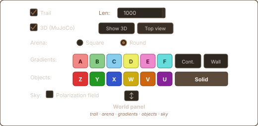
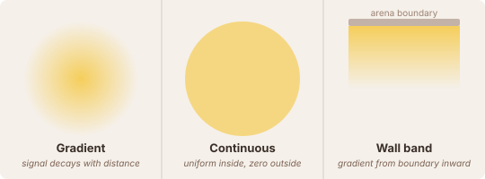
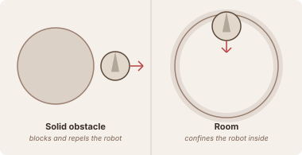
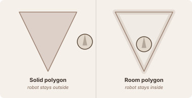
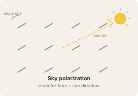

# Creating Worlds

The **arena** is the environment your robot lives in. It can contain gradient fields that sensors detect, solid obstacles that block movement, and a sky polarization pattern for compass experiments. Everything you place is saved with the session config and reloaded automatically on the next run.

All world editing happens in the **World** tab of the control panel. Changes take effect immediately — you can reshape the world while the brain is running.

---

## Gradient fields

Gradient patches are invisible stimulus fields. They have no physical presence — the robot passes through them freely — but sensors like `GradientSensor`, `ColorSensor`, and `InteroceptiveSensor` detect their signal.

Each patch has a **label** (A–F) and a **colour** (red, green, blue, yellow, magenta, cyan). Sensors subscribe to a label; a sensor set to label `A` only reads patches labelled `A`. You can have multiple patches of the same label — the sensor receives the maximum signal over all of them.

### Gradient (default)

Signal decays linearly from 1.0 at the centre to 0.0 at the edge:

$$\text{sig} = \max\!\left(0,\; 1 - \frac{d}{r}\right)$$

**To place:** click a colour button in the *Gradients* row, then drag on the arena (drag start = centre, drag end = radius).

### Continuous

Same shape, but the signal is a flat 1.0 everywhere inside the radius and drops to exactly 0.0 at the boundary. Useful for food zones where stimulus intensity should not depend on position.

**To place:** toggle **Cont.** on before dragging.

### Wall band

A gradient that emanates from the arena boundary inward. There is no `x/y` centre — it covers the entire perimeter. Useful as a looming-wall sensor input for avoidance.

**To place:** toggle **Wall** on, then drag (the drag distance sets the band width).

### Mounted gradient

A gradient patch that follows the robot. Place it by starting your drag from inside the robot's body disk. Useful for interoceptive signals ("smell of self") or for creating an energy field the robot carries around.

---

## Solid obstacles

Circular objects that physically block the robot. The simulator pushes the robot out whenever they overlap. Distance, collision, whisker, and camera sensors all detect solid obstacles.

### Circular obstacle

A filled circle that the robot cannot enter. Click a colour button in the *Objects* row and drag to place (drag start = centre, drag end = radius). The **Solid** toggle must be active (default).

### Room (circular confinement)

The robot is kept **inside** the circle. When the robot tries to leave, the simulator pushes it back toward the centre. Rendered as an annular ring rather than a filled disk.

**To place:** toggle **Solid** off (button switches to *Room*), then drag.

---

## Polygon walls

Freehand-drawn polygon boundaries. Click individual vertices on the arena to draw; the polygon closes automatically when you click near the first vertex (or after at least 3 points). Hold **Shift** to snap edges to 45° increments.

The **Solid / Room** toggle controls whether the polygon is a wall the robot stays outside (solid, filled) or a boundary the robot stays inside (room, hollow band).

Right-click while drawing to cancel.

---

## Sky polarization

A global celestial field that the `SkyCompassSensor` reads. It does not affect any other sensor and has no physical presence.

The field consists of a repeating pattern of e-vector bars at angle `sky.angle`. The sun direction is perpendicular: `sun_dir = sky.angle + π/2`. The `SkyCompassSensor` computes a cosine tuning curve over its `n` neurons relative to the current heading versus `sun_dir`.

**To configure:** tick **Polarization field** in the *Sky* row to enable it. Click the **↕** button and drag on the arena to set the angle.

---

## Sensor interaction table

| Object type | GradientSensor | ColorSensor | DistanceSensor | CollisionSensor | WhiskerSensor | CameraSensor | SkyCompassSensor |
|---|---|---|---|---|---|---|---|
| Gradient circle | ✓ | — | — | — | — | — | — |
| Continuous circle | ✓ | — | — | — | — | — | — |
| Wall band | ✓ | — | — | — | — | — | — |
| Solid obstacle | — | ✓ | ✓ | ✓ | ✓ | ✓ | — |
| Room circle | — | ✓ | ✓ | ✓ | ✓ | ✓ | — |
| Polygon wall | — | — | ✓ | ✓ | ✓ | ✓ | — |
| Sky field | — | — | — | — | — | — | ✓ |

---

## Tips

- **Right-click** on any placed object to delete it.
- **Drag** in *Move* mode (select *Move* in the toolbar) to reposition patches and obstacles.
- The **Cont.** and **Wall** toggles apply to whichever gradient colour is currently selected.
- Sessions (brain params + world layout) are saved as JSON in `configs/`. Use **Save config** in the control panel to snapshot the current world.
- Multiple gradient patches of the same label stack by maximum, not sum. Place several overlapping patches to widen a field without increasing peak intensity.
