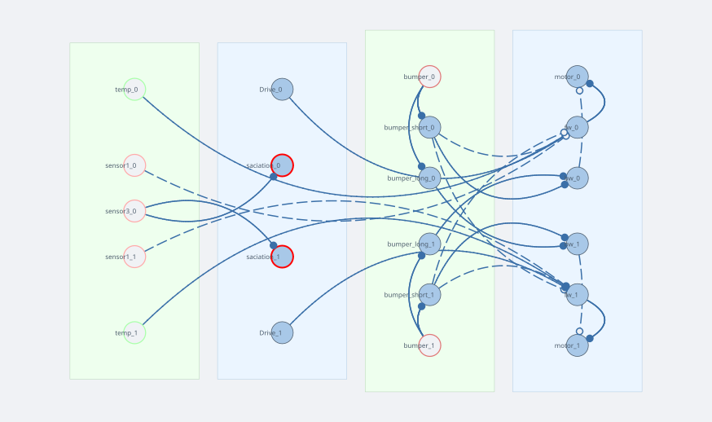

# FeedingBrain

**FeedingBrain** is a hunger-driven vehicle. It cruises through the arena seeking gradient-A patches (food), slows to consume them, and gradually loses interest in food as it fills up — then resumes looking once depleted. It avoids walls using a two-timescale bumper reflex.

Load it from `simulation/2d/networks/FeedingBrain.json` via the network editor.

---

## Network diagram



**Weight notation** — `+I` = identity matrix (ipsilateral, same side), `−I` = negative identity, `+J` = fliplr identity (contralateral, crossed), `−J` = negative fliplr. A dashed violet line is a neuromodulator, not a synaptic weight.

---

## Sensors

| Name | Type | Gradient | Notes |
|------|------|----------|-------|
| `temp` | GradientSensor | B | Warmth cue; drives forward attraction unconditionally |
| `sensor1` | GradientSensor | A (ReLU) | Food cue; attraction gated by insulin satiety signal |
| `bumper` | CollisionSensor | — | Bilateral; fires on contact with obstacles |
| `sensor3` | InteroceptiveSensor | A | Tracks cumulative food contact; drives satiety |

---

## Layers and connections

### Forward path — what makes the robot go

```
Drive (50)  ──+I──►
temp        ──+I──►  fw  ──+I──► motor
sensor1     ──−I──►
```

`fw` is a `LeakyLayer` that sums three inputs. A constant `Drive` of 50 keeps the robot moving even in the absence of cues. `temp` (gradient B) excites `fw` ipsilaterally — more warmth on the left increases the left motor, which curves the robot toward the warmer side. `sensor1` (food, gradient A) *inhibits* `fw` ipsilaterally. Because inhibiting the *same-side* motor turns the robot toward the stimulus, this is an approach response: more food on the right → right motor decreases → robot curves right.

### Satiety loop — what makes the robot stop caring about food

```
sensor3  ──0.02──► saciation  ══insulin══► (modulates sensor1 pre-synaptically, −1.0)
```

`sensor3` is an `InteroceptiveSensor` that accumulates gradient-A exposure over time (very slow rise, τ=10 s, τ_decay=100 s). It drives `saciation`, which acts as a neuromodulator source: its output is broadcast as **insulin** on the neuromodulator bus. Insulin suppresses `sensor1`'s output before it reaches `fw` (pre-synaptic, weight −1.0). As the robot feeds, insulin rises, the food signal shrinks, and the approach drive fades. Once the robot moves away from food, `sensor3` decays slowly and hunger returns.

### Bumper path — what makes the robot turn away from walls

```
bumper ──+I──► bumper_short (τ=0.5)  ──+I──► bw
                                       ──−J──► fw   (brakes)
       ──+I──► bumper_long  (τ=1.5)  ──+J──► bw
```

`bw` (backward drive) feeds into `motor` with weight `−I`, subtracting from the forward speed. The two timescales produce different effects:

- **bumper_short** (fast, τ=0.5 s): same-side excitation of `bw` → sharp turn away from the struck side. Also sends `−J` (inhibitory crossed) to `fw` → brakes both motors on contact.
- **bumper_long** (slow, τ=1.5 s): crossed excitation of `bw` → sustained contralateral push that keeps the robot turning long after the initial contact.

Together they implement the classic escape reflex: touch right side → brake immediately, then arc left over the next second or two.

---

## Behaviour to observe

1. Place several gradient-A patches (food) and one gradient-B patch (warmth) in the arena.
2. Start the simulation. The robot approaches food patches and slows as it enters them.
3. After sustained contact, the `saciation` layer fills and the food attraction weakens. The robot drifts toward warmth instead.
4. Watch the `saciation` output in the oscilloscope — it rises slowly, plateaus, then drains once the robot leaves the food area.
5. Place a wall segment to trigger the bumper reflex. Note how the robot snaps back quickly (`bumper_short`) then continues curving away (`bumper_long`).

---

## Key parameters to tune

| Parameter | Where | Effect |
|-----------|-------|--------|
| `Drive` constant value | layer editor | Baseline cruising speed |
| `sensor1` weight to `fw` | connection editor | Food attraction strength |
| `saciation` τ_decay (100 s) | layer editor | How quickly hunger returns |
| `bumper_long` τ_decay (1.5 s) | layer editor | Duration of post-collision turn |
| `sensor1` scale (40) | sensor params | Detection range for food patches |
