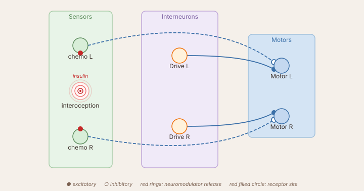

# Neuromodulators

Synaptic weights control *where* a signal goes. A neuromodulator controls *how strongly* a layer responds — without a direct synapse to every target. A single slow signal can raise or lower the sensitivity of an entire pathway depending on the animal's internal state.

This tutorial builds a simplified **FeedingBrain**: a creature that approaches food, eats, and gradually loses interest as it fills up — because interoception suppresses chemosensation.

---

## The circuit



Three pathways share the motor:

| Pathway | Connection | Behaviour |
|---------|-----------|-----------|
| `food` → motor | `−I` (same-side inhibition) | **Approach**: more food on right reduces right motor → robot turns right |
| `Drive` → motor | `+50` to both | Baseline forward motion even without stimulus |
| `intero` → `saciation` → releases **insulin** → suppresses `food` | pre-synaptic, −1.0 | **Satiety loop**: prolonged feeding silences the food-seeking drive |

A dashed line is the neuromodulator — it carries no weight matrix, only a scalar gain signal released by `saciation` each tick.

---

## Code

```python title="brains/FeedingBrainSimple.py"
import numpy as np
from brain_base import BaseBrain, Param
from sensors import GradientSensor, InteroceptiveSensor
from neurons import SumLayer, ConstantLayer, LeakyLayer


class FeedingBrainSimple(BaseBrain):

    sensors = [
        GradientSensor(n=2, angle_spread=0.4, gradient='A', name='food',
                       modulators=[('insulin', -1.0, 'pre')]),  # (1)
        InteroceptiveSensor(gradient='A', name='intero'),
    ]

    drive     = ConstantLayer(value=1.0, n=1, name='drive')
    saciation = LeakyLayer(
        tau_rise=10.0, tau_decay=100.0, activation='relu', n=1,
        name='saciation',
        neuromodulator_transmitter='insulin',                   # (2)
    )
    motor = SumLayer(activation='linear', n=2, name='motor')
    layers = [drive, saciation, motor]

    speed = Param(50.0, 0, 100, step=1.0, desc='Base motor speed')

    connections = [
        ('food',  'motor',     -np.eye(2)),          # (3)
        ('drive', 'motor',      np.ones((2, 1))),    # (4)
        ('intero', 'saciation', np.array([[0.02]])), # (5)
    ]

    def setup(self):
        pass

    def loop(self, dt):
        self.step_network(dt)
        mL, mR = self.motor.output * self.speed
        return float(mL), float(mR)
```

1. `food` declares it is suppressed by `'insulin'` at the **pre**-synaptic site. Its effective contribution to the motor becomes `food_output × (1 − 1.0 × insulin)`. When insulin → 1, chemosensation is fully silenced — the robot is "blind" to food.
2. `saciation` **releases** `'insulin'` by publishing its mean output to the neuromodulator bus every tick. `tau_rise=10 s` → fills slowly during feeding; `tau_decay=100 s` → hunger returns very slowly once the robot leaves the food area.
3. `−np.eye(2)` = same-side inhibition. Inhibiting the ipsilateral motor against the constant drive steers the robot **toward** the stimulated side. This is the approach (not avoidance) wiring.
4. `np.ones((2,1))` broadcasts the single Drive neuron to both motors. Scale by `self.speed` in `loop()`.
5. Weight 0.02 keeps `saciation` from saturating immediately — it fills over many seconds of sustained contact with gradient A patches.

---

## What to observe

1. Place several gradient-A patches in the arena and run the brain.
2. The robot approaches patches and slows as it enters them.
3. Watch `saciation` in the oscilloscope — it rises slowly while the robot feeds.
4. As insulin climbs, the food sensor's contribution shrinks and the approach drive fades.
5. Once `saciation` is high, the robot drifts forward without food-seeking. Over ~100 s, saciation decays and hunger returns.

---

## Wiring details — pre vs post

| Site | What is scaled | When to use |
|------|---------------|-------------|
| `'pre'` | input before integration | suppress or amplify the *drive into* the element — layer memory keeps running on a smaller signal |
| `'post'` | output after integration | gate what is *sent downstream* — internal dynamics are unchanged |
| `'none'` | nothing | declare for learning rules or visualisation only |

Both sites can appear together on the same element: `modulators=[('insulin', -1.0, 'pre'), ('arousal', 2.0, 'post')]`.

---

## Running remotely

The brain can run headlessly on any machine while the simulator runs on another. The simulator acts as a UDP sensor-motor host; this brain is the client.

**From the command line:**

```bash
python sim_net_client.py HOST:9001 0 networks/FeedingBrainSimple.json
#                        ^^^^
#                        Replace with the simulator machine's IP address.
#                        The simulator shows its IP in the status bar
#                        when host mode is active.
```

**From Python** — useful when you want to configure the connection programmatically:

```python
HOST = '192.168.1.10'  # ← simulator machine's IP address
PORT = 9001            #   default SimNet port

from sim_net_client import SimNetClient

client = SimNetClient(host=HOST, host_port=PORT,
                      local_port=PORT + 1, slot=0)
client.start()
# The client's recv thread handles sensor packets and sends motor commands
# back automatically when used in headless (run_blocking) mode.
```

`slot=0` is the agent index on the host side. If multiple remote brains connect simultaneously, each uses a different slot number.

---

## Going further

- See the full [FeedingBrain](feedingbrain.md) for the two-timescale bumper reflex added on top of this satiety loop.
- Add a temperature sensor (`gradient='B'`, `+I` wiring) to give the robot a secondary drive that competes with food-seeking as insulin rises.
- Chain modulators: a fast `'arousal'` signal (τ ≈ 0.5 s) from a `CollisionSensor` can amplify the motor path while insulin simultaneously suppresses chemosensation.
