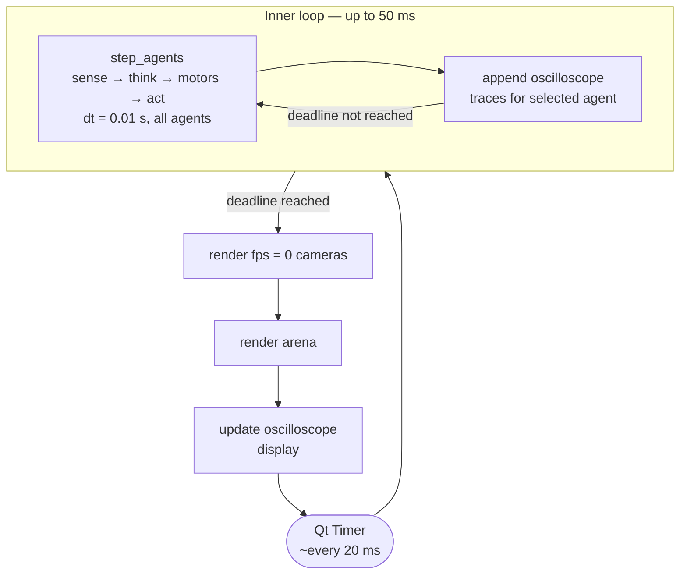
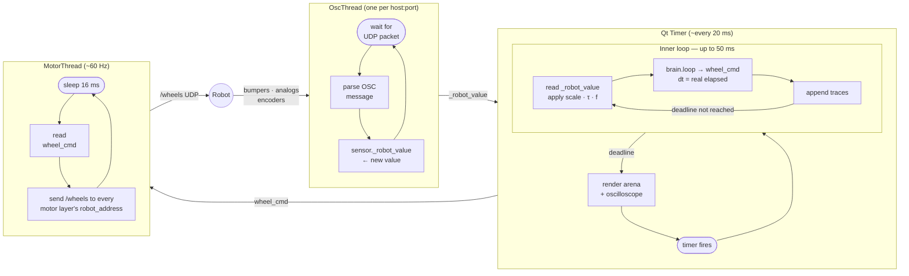
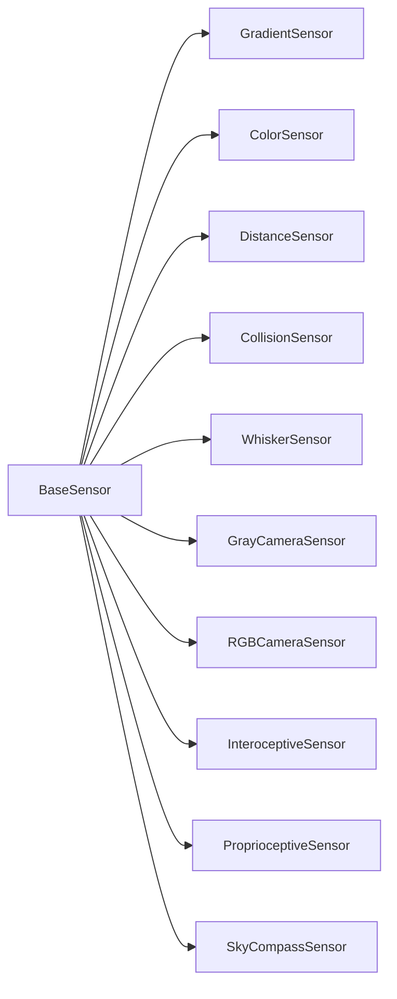
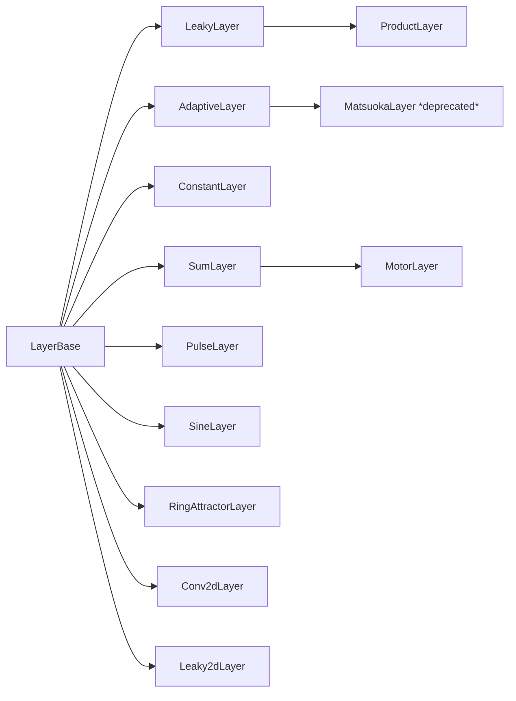

# Class Reference

A file-by-file, class-by-class listing of the simulator's Python source. If you haven't yet, read [Architecture](architecture.md) first for the mental model this reference assumes.

---

## Timing

The simulator separates **physics/network stepping** from **display rendering** — and in real-robot mode, also from **sensor I/O** and **motor output**. This holds whether one agent or many are running: the inner loop just does more work per iteration when there are more agents.

### Simulation mode



Because the inner loop runs many steps before handing control back to the GUI, the **network executes at ~200+ steps/s** while the **display updates at ~14 Hz**.

| Component | Typical rate |
|---|---|
| Qt timer fires | ~14 Hz |
| Physics + network step (all agents) | ~230 Hz |
| Arena repaint | ~14 Hz |
| Oscilloscope update | ~14 Hz |

### Real-robot mode

Three concurrent activities share the process, each at its own rate.



| Thread | Rate | Driven by |
|---|---|---|
| OscThread | robot send rate (~60 Hz) | incoming UDP packets |
| Qt loop — network | ~230 Hz | 50 ms deadline |
| MotorThread | ~60 Hz | fixed 16 ms sleep |

!!! note "Thread safety"
    The simulator relies on Python's GIL rather than explicit locks. `OscThread` writes `sensor._robot_value`; the Qt thread reads it — a stale read is at most one robot transmission cycle old, which is harmless. `MotorThread` reads `RobotModeController.wheel_cmd` (a tuple, replaced atomically by the Qt thread each step) every 16 ms; the worst case is one network step stale, well within motor latency tolerance.

---

## App shell

### `LBPSimulator.py` — `SimulatorApp`

The Qt main window. Its job is layout and wiring: it creates the panels, instantiates the controller objects, and routes Qt signals to them. Each tab's behaviour lives in its own mixin file; `LBPSimulator.py` keeps window construction, run control, the simulation-setting handlers, manual driving, MuJoCo start-up, the joint dialog and keyboard handling.

It only reaches the simulation through `SimController`'s collaborators — `sim_ctrl.registry` (agents, groups, selection), `.sim`, `.network`, `.robot`, `.mujoco` — never through private fields.

| File | Mixin | Owns |
|---|---|---|
| `sim_app_ui.py` | `_UiBuilderMixin` | building the control panels |
| `sim_app_agents.py` | `_AgentsMixin` | the agent table; add / remove / select / recolor agents and groups; selecting by clicking the arena |
| `sim_app_brain.py` | `_BrainMixin` | brain combo and parameters, network-file load/save for the selected agent, `_sync_group_network` |
| `sim_app_session.py` | `_SessionMixin` | Session / Task / Logger tabs, session save / load |
| `sim_app_network.py` | `_NetworkMixin` | Network tab: off / host / client, connecting, agents for remote clients |
| `sim_app_robot.py` | `_RobotMixin` | Robot tab: real-robot mode, address rows, update-rate readouts |
| `sim_app_world.py` | `_WorldMixin` | World tab: draw modes, world setup, world save / load, textures |

The arena's robot disks follow the agent list automatically: the registry reports adds, removes and selection changes, and `SimController.sync_robot_items()` updates the arena (call it yourself only after changing an agent's color).

### `sim_app_session.py` — `_SessionMixin`

Owns the Session/Task/Logger tab builders, `_save_session` / `_load_session`, and `_load_session_agents`, which reconstructs the full multi-agent/group layout from a session JSON's `agents` array.

---

## Simulation core

### `Simulation` — the world, advanced one step at a time

`simulation.py` (no Qt)

`Simulation` holds the `World`, `SimConfig`, the `AgentRegistry` (agents and groups), the `MuJoCoEngine`, the simulated time and the active task. `step(motor_for)` advances every agent by one `dt` via `sim_engine.step_agents` and then ticks the task once with every agent's position; `reset()` returns everything to t = 0; `render_free_running_cameras()` renders `fps = 0` cameras between batches of steps. Everything that touches a screen, a wall clock, a file or a network is the caller's job — the app's `SimController`, or `headless.py`.

### `session_loader` / `headless` — running without the GUI

`session_loader.build_simulation(path)` builds a reset `Simulation` from a saved session file: world and sim params (`apply_session_world`), every agent group, and each brain via `BrainManager.install_brain` — the same functions the GUI's session/brain loading uses, so a headless run matches the app exactly. `headless.py` runs it from the command line (`python src/headless.py <session> --seconds N [--seed S] [--out run.csv]`) or from Python (`headless.run(..., on_step=...)` for sweeps).

### `data_paths` / `updater` — where files live, and updates

`data_paths.py` knows the two roots with the same layout (`configs/`, `networks/`, `worlds/`, `motifs/`, `brains/`, `textures/`, `logs/`): the app folder (built-in content, read-only in the UI, replaced by updates) and the user folder (`user_dir()`: the Session tab setting, else `private/` in the private repo, else `~/LBPSimulator`; `LBP_USER_DIR` overrides). `resolve(kind, ref)` finds a referenced file — `builtin:` forces the app root, a plain reference tries the user root first; `files`, `builtin_subdirs`, `user_subdirs` and `folder_for` feed the pickers. `write_manifest` / `migrate_user_files` move a user's own files out of an old public install's app folder (only where `manifest.json` exists). `updater.py` is active only in a public copy (`release.json`): `latest_version()` reads the public `VERSION`, `apply_update()` downloads the repo zip, stages and checks it, migrates user files, copies the new files over and removes shipped files the new version dropped.

### `SimController` — the app's simulation loop

`sim_controller.py`

`SimController` drives a `Simulation` from the app: the `QTimer`, the running/paused flag, speed multiplier, real-time mode, keyboard control, and feeding the oscilloscope, `SimLogger` and arena. Each tick it decides each agent's motor source (keyboard > network client > its own brain), calls `Simulation.step`, and emits a single `sig_frame_ready(agents, selected_agent_id, sim_cfg, world, trail_visible, overhead_rgb)` signal that `ArenaWidget` and `OscChannelManager` both listen to. Network host/client and real-robot I/O also live here; robot and client modes run the brain through the same think/motors functions as the simulator (`sim_engine.run_brain` / `choose_motor_command`).

**`RobotAgent`** (dataclass) — one robot's state bundle:

| Field | Meaning |
|---|---|
| `id` | Stable identity, assigned once, never reused or shifted when other agents are removed |
| `circuit` | This agent's `CircuitModel` |
| `brain` | Its `BaseBrain`/`DataBrain` instance (or a placeholder, for remote agents) |
| `bot_pos` | `[x, y, theta]` |
| `trail_xy` | Ring buffer of recent positions |
| `brain_mgr` | Its `BrainManager` |
| `name`, `color` | Display identity |
| `remote` | `True` if motors come from a connected `SimNetClient` rather than a local brain |

**`AgentGroup`** (dataclass) — a row in the agent table: `id`, `module` (brain filename, or `None` for a remote group), `color`, `name`, and `member_ids` (agent ids sharing this brain; `member_ids[0]` is the template used when growing the group or saving).

Every cross-reference to a robot — the selection, a gradient's `mounted_on`, a network slot — stores the agent's **id**, resolved through `_agent_by_id` / `index_of_agent`, never a raw list index. Using list position as identity was a real source of bugs (a mounted gradient reattaching to the wrong robot, or the wrong agent getting reselected after a removal); see `TODO.md`'s "stable-agent-id refactor" entry for the history.

### `network_runner` — neural forward pass

`network_runner.py`

`step_network` is the neural forward pass extracted from `BaseBrain`. It reads `layers`, `connections`, and `sensors` from the brain instance, propagates signals through the weight matrices, applies neuromodulation, and mutates `layer.output` in place. Incoming connections are summed by default; a `ProductLayer` target is special-cased to combine them by elementwise product instead.

### `sim_engine` — one simulation step

`sim_engine.py`

A module of pure functions, no Qt imports. `step_agents(agents, world, sim_cfg, engine, t, motor_for)` advances every agent by one step in four phases: **sense** (2-D field sensors via `sample_field_sensors`, MuJoCo contacts, cameras whose frame is due — all at time `t`, before any brain runs), **think** (`brain.loop(dt)`), **motors** (a keyboard/network command from `motor_for` replaces the brain's wheel command and is written back with `apply_motor_command`), and **act** (`engine.move_agents`). The engine is passed in, so tests can use a stand-in.

### `sim_engine_mujoco.py` — `MuJoCoEngine`

The MuJoCo side of the simulation, always running. Builds a per-tick-rebuildable XML model covering every agent, arena walls, and objects. Key methods: `owns_sensor()` (cameras and root-mounted `CollisionSensor`s are MuJoCo's; everything else is 2-D), `sample_collision_sensors()` and `render_cameras()` (sense phase), `move_agents()` (act phase — drives **all** agents together in one physics step, so they can collide with each other), `render_overhead()` (top-down image composited into `ArenaWidget`), `launch_viewer()` (interactive 3-D window).

!!! warning "Legacy file"
    `mujoco_bridge.py`'s `MuJocoBridge` class is an earlier, single-robot, passive-viewer experiment. It predates `sim_engine_mujoco.MuJoCoEngine` and is no longer imported anywhere — treat it as dead code, not as the current MuJoCo integration.

### `WorldEditor` — arena editing

`world_editor.py`

Owns the draw-mode state machine: `'gradient' | 'object' | 'wall' | 'wall_paint' | 'sky' | 'move'`. Implements the arena mouse handlers that mutate `World` and request a display refresh. Also handles mounting a gradient patch onto a specific robot (it then tracks that robot's pose every tick) and is multi-agent aware for mount-snapping and per-agent cleanup.

### `OscChannelManager` — oscilloscope

`osc_controller.py`

Owns the set of tracked oscilloscope channels, their colours, per-channel multiplier spinboxes, and trace ring-buffers, all for the **currently selected agent only**. Discovers which channels the active brain and circuit expose and rebuilds the plot layout when the brain or the selected agent changes. `on_frame_ready()` is its slot on `SimController.sig_frame_ready`.

### `BrainManager` — plugin loading and circuit wiring

`brain_manager.py`

Discovers Python files in `brains/`, imports them, finds the class that inherits `BaseBrain`, instantiates it, and populates a `CircuitModel`. Also synthesises the motor `SumLayer` for each joint and wires `ProprioceptiveSensor` instances onto articulated bodies automatically.

### `SimLogger` — data recording

`logger.py`

`start(path)` / `stop()` / `log(time_index, bot_pos, raw_signals, world)` — records a run's state to CSV for later analysis, independent of the oscilloscope.

---

## Distributed simulation networking

This is unrelated to the real-robot OSC protocol (see below) — it's a JSON-over-UDP link between two **simulator instances**.

### `SimNetHost`

`sim_net_host.py`

One UDP socket plus one receiver thread. Tracks a `_RemoteSlot` per connected client (motor cache, `ready` flag, Hz stats). All messages are JSON, zlib-compressed on the wire (falls back to reading them as uncompressed for backward compatibility):

| Direction | Message | Payload |
|---|---|---|
| client → host | `register` | `slot` request, client `name`, full circuit JSON |
| client → host | `heartbeat` / `ready` / `disconnect` | keep-alive and lifecycle |
| client → host | `motors` | `{mL, mR}` |
| host → client | `ack` | assigned `slot` |
| host → client | `sensors` | `{slot, dt, data}` |
| host → client | `go` | tick-synchronised start signal |

`prune_stale()` drops clients that go quiet without a clean disconnect.

### `SimNetClient`

`sim_net_client.py`

Mirrors the host: `pop_sensors()` / `send_motors()` for use inside the GUI, plus `run_blocking()` for a **headless CLI client** (`python sim_net_client.py host:port network.json`) with no Qt dependency at all.

### How a remote agent is born

When a client registers, `SimController` parses its circuit JSON (`load_network_json`), builds a `CircuitModel` containing just that client's sensors/bodies/joints (no layers or connections needed host-side), attaches a no-op placeholder brain, and calls `add_agent(..., remote=True)`. The host samples and sends exactly the sensors that client declared — earlier versions used one fixed circuit for every client, which could overrun the UDP packet size for camera-equipped robots.

---

## Rendering & views

### `ArenaWidget` — the main 2-D scene

`arena_widget.py`

Keeps a `RobotItem` and a trail `PlotDataItem` per agent. `add_robot_item` / `remove_robot_item` / `select_robot` / `update_robot_pos` provide cheap updates for non-selected agents; the **selected** agent gets a full update each frame (wheels, sensor rays, child bodies). `sync_agents()` / `on_frame_ready()` is the slot wired to `SimController.sig_frame_ready`. Also owns `set_3d_mode` / `set_overhead_frame` (compositing the MuJoCo top-down image) and the `PolyWallItem` / `CircleItem` world-object graphics.

### `NetworkVisualizerWindow` and friends

`NetworkVisualizerWindow` (`network_viz.py`) is the window itself — toolbar, palette, side panels, z slider, Qt event hooks, `build()`, and the edit-transaction / undo hooks — and holds five parts, each with a reference back to the window (`self.win`):

| File | Part (window attribute) | Covers |
|---|---|---|
| `network_viz_layout.py` | `LayoutEngine` (`layout_engine`) | where every node and column goes (`compute()` → `LayoutResult`), column bookkeeping for edits (snap, insert, compact); no Qt. Geometry helpers (bezier, bow) are module functions |
| `network_viz_render.py` | `NetworkRenderer` (`renderer`) | all pyqtgraph item creation and mutation — nodes, edges, panels, notes, thumbnails — and the live refresh (activity colours, Weights / Activations panels) |
| `network_viz_dialogs.py` | `NetworkDialogs` (`dialogs`) | sensor / layer / body / note create and edit dialogs; also `WeightMatrixDialog`, `FilterStackDialog`, `PaletteChip` |
| `network_viz_editing.py` | `NetworkEditing` (`editing`) | clicks and context menus, hit-testing, selection, every circuit-mutating user action; also `NetworkViewBox` |
| `network_viz_serialization.py` | `NetworkPersistence` (`persistence`) | Save (network JSON / brain Python), motifs, copy selection, Bonsai / SVG export |

The changing state lives in three objects, each written by one part:

| Object | Owner | Holds |
|---|---|---|
| `LayoutResult` (window `_lay`) | layout — returned by `LayoutEngine.compute()`, replaced on every build | node positions, columns (`container_x_map`, `node_container_map`, spans), the view-fit extent, and the z-cut state (active / subsumed names, ghosts) |
| `SceneItems` (`renderer.drawn`) | render — a fresh one per build | every drawn pyqtgraph item (nodes, edges, panels, labels, image thumbnails, notes) and the per-node caches the refresh timer reads |
| `Selection` (`editing.sel`) | editing | selected node / edge / note, the shift-click multi-selection, the highlighted node and ring overrides |

`network_viz_context.py` holds `NetworkVizContext`, the narrow DI facade bridging the visualizer to `SimulatorApp` — it doesn't fit any of the five responsibility categories above, so it gets its own small file.

### `side_view.py` — network layout editor

Despite the name, this is **not** a physical/sagittal view of the robot. It's a drag-and-drop grid editor — columns are processing depth, rows are subsumption "z-level" — used to arrange the network diagram's layers and sensors. The coordinates it produces feed `net_view_3d.py`.

### `net_view_3d.py` — `NetView3DWindow`

A read-only, rotatable OpenGL (`pyqtgraph.opengl`) 3-D rendering of **the circuit graph** (nodes = sensors/layers, Bezier arcs = connections, colour-coded excitatory/inhibitory) — not a 3-D view of the robot or arena. Its layout comes from `side_view.py`.

---

## World & circuit data

### `World` — the physical environment

`world.py`

Owns everything that is not the robot: gradient patches, solid obstacles, polygon walls, the arena boundary, and the sky (for the compass sensor). Plain data container — no rendering or physics logic.

### `CircuitModel` — shared circuit state

`circuit_model.py`

A plain container holding the lists that define one agent's circuit: `sensors`, `layers`, `connections`, `bodies`/`joints` and `notes`, plus `history` — that agent's undo stack. `connections` is a list of `Connection` dataclass objects (`src`, `tgt`, `W`, `learning`, `lr`).

### `lateral` — L/R pairs

`lateral.py` (no Qt)

Everything about lateral pairs in one place: `side_of`, `base_name`, `mirror_name`, `half_names`, `partner_layer` (via `lateral_pair`), `parent_sensor` (of a `_L`/`_R` half), `is_camera_half`, `is_body_pair_half`, `is_lateral_half`. Nothing else parses `_L` / `_R` suffixes.

### Layer and sensor capabilities

Each layer / sensor class declares what it is — e.g. `is_image_node`, `accepts_image`, `kernel_weights`, `passthrough_input`, `supports_lateral`, `is_learning` on layers; `is_camera`, `needs_other_agents`, `uses_mujoco_contacts` on sensors — and the runner, step, MuJoCo engine, serializer and editor ask these instead of checking for concrete classes. A new layer type only sets what applies to it (see `rules/network_elements.md` §4).

### `circuit_editor` — edit transactions and undo

`circuit_editor.py` (no Qt)

Every edit of a circuit runs as one transaction (`CircuitEditor.edit()`, or `@edit_transaction` on visualizer methods): the undo snapshot is taken before anything changes, nothing is recorded if nothing changed, and afterwards the brain is re-synced with the circuit and `brain._topology_version` is bumped so `step_network` rebuilds its caches. Undo restores everything, including bodies, joints, notes and column labels; the stack holds the last 50 edits, lives on the `CircuitModel` (so it survives closing the window and never crosses agents) and is cleared when a brain or network is loaded. The module also holds the lateral-pair rules used by the editor: `find_mirror`, `rename_layer`, `unpair_layer` (lateralized switched off), `apply_renames`. Column numbers of hidden / disabled columns are renumbered in place by `NetworkVisualizerWindow.renumber_columns` whenever columns move (insert, compact), because the app holds and saves the same set objects.

### `RigidBody` / `Joint` — articulated robot body

`rigid_body.py`

`RigidBody` is a named disk with a radius. Every robot has a root body (the drive disk); extra bodies attach via `Joint`s — for example a passive or motor-driven segment carrying its own sensors.

### `SimConfig` — shared simulation parameters

`sim_config.py`

Holds knobs global to a session: timestep `dt`, arena size, robot body radius, maximum speed, and similar constants. A `BaseConfig` subclass, so any `Param` declared on it automatically generates a GUI slider.

| Parameter | Default | Description |
|---|---|---|
| `dt` | 0.01 s | Simulation timestep |
| `arena_scale` | 5.0 m | Arena half-width |
| `motor_gain` | 1.0 | Motor speed multiplier |
| `body_radius` | 0.2 m | Robot body radius |
| `sense_radius` | 1.0 m | Sensor ray length |
| `init_x`, `init_y` | 0, 0 | Robot start position |
| `stim_radius` | 0.5 m | Radius of new gradient patches |
| `toggle_stim` | on | Show / hide stimulus patches |
| `fixate_robot` | off | Freeze robot position |

---

## Brains

### `BaseBrain` / `DataBrain` — the control law

`brain_base.py`

`BaseBrain` is the base class every brain plugin inherits. Class-level `Param` and `ChoiceParam` descriptors declare tunable knobs that `BaseConfig.__init__` copies to instance attributes; the GUI reads the metadata to build sliders automatically.

`DataBrain` extends `BaseBrain` for brains loaded from a JSON network file — it rebuilds `layers`, `connections`, and `sensors` from the serialised description, so the brain file contains only data, no Python logic.

---

## Sensors — transduction

`sensors.py`

`BaseSensor` defines the contract every sensor satisfies: `sample(x, y, theta, world, sim_cfg)` maps the robot's pose and world state to a numpy array, stored on the brain as `brain.<sensor.name>`. All sensors share an optional output pipeline: Gaussian noise → asymmetric leaky dynamics (`tau_rise` / `tau_decay`) → activation function → `output_mode` (none / derivative / integral).



| Class | What it detects |
|---|---|
| `GradientSensor` | Soft circular gradient patches; casts n rays in a fan, returns field intensity per ray |
| `ColorSensor` | Solid coloured circular objects via ray-circle intersection |
| `DistanceSensor` | Normalised proximity to the nearest wall, obstacle, or other agent (1 = touching, 0 = at max range) |
| `CollisionSensor` | Contact within n arc sectors around the robot perimeter, including other agents (1 = contact, 0 = clear) |
| `WhiskerSensor` | Tactile whisker: bending proportion from 0 (no contact) to 1 (contact at base) |
| `GrayCameraSensor` | Wide-angle raycasted image (luminance); output shape `(H × W,)` |
| `RGBCameraSensor` | Wide-angle raycasted image (colour, CHW); output shape `(3 × H × W,)` |
| `InteroceptiveSensor` | Internal gut state: integrates gradient exposure at the mouth over time (scalar) |
| `ProprioceptiveSensor` | Joint angle or angular velocity of articulated body segments |
| `SkyCompassSensor` | Polarised-light sky compass (DRA); encodes heading relative to sun direction |

Both camera sensors support `lateralized=True`, splitting the image at the horizontal midline into `sensor_L` / `sensor_R` halves, each feeding its own `Conv2dLayer`.

---

## Neuron layers — neural dynamics

`neurons.py` re-exports everything below and maintains `LAYER_REGISTRY` for JSON deserialisation. `LayerBase` is a thin `nn.Module` mixin adding display and neuromodulation attributes shared by every layer type (`name`, `color`, `group`, `modulators`, …).



| Class | Dynamics |
|---|---|
| `LeakyLayer` | First-order low-pass filter (`dx/dt = (u−x)/τ`); asymmetric rise/decay, derivative mode, OU noise |
| `ProductLayer` | `LeakyLayer` dynamics, but incoming connections combine by elementwise product instead of sum |
| `AdaptiveLayer` | Leaky integrator with spike-frequency adaptation; `w > 0` + `n=2` gives half-centre oscillation |
| `MatsuokaLayer` | *(deprecated — use `AdaptiveLayer`)* Thin wrapper kept for loading old JSON networks |
| `ConstantLayer` | Fixed output; tonic drive source, ignores incoming connections |
| `SumLayer` | Instantaneous weighted sum; no dynamics, no memory |
| `MotorLayer` | `SumLayer` + robot actuation; sends output via OSC to `robot_address` in real-robot mode |
| `PulseLayer` | Plateau-potential neurons with sustained activation and inhibitory reset |
| `SineLayer` | Autonomous sine-wave generator; ignores incoming connections |
| `RingAttractorLayer` | N leaky neurons on a ring; recurrent connectivity via a self-connection (Mexican-hat kernel) |
| `Conv2dLayer` | 2-D convolution over camera input; per-filter global pooling; optional leaky dynamics and adaptation |
| `Leaky2dLayer` | Pixel-wise leaky integrator that preserves full spatial image structure; feeds into `Conv2dLayer` |
| `AccumulatorLayer` | Integrates input over time without decay |
| `DeltaLayer` | Reports the change in its input since the previous step |
| `Reichardt2dLayer` | Elementary motion detector over 2-D input (Reichardt correlator) |
| `TDLayer` | Temporal-difference learning layer |
| `ThreeFactorLayer` | Three-factor (Hebbian + neuromodulator) learning layer |
| `SnapshotLayer` | One-shot vector-memory neuron — overwrites its *outgoing* connection weights from a named source layer on a reward trigger |

---

## Persistence & export

### `session_io` — save / load

`session_io.py`

Two pure functions, `save_session` and `load_session`, serialise and deserialise the full simulator state (agents, brain params, world patches, sim config, oscilloscope multipliers) as JSON.

Each agent group says what it runs: `{"mode": "code", "module_name": "BrainARS", "brain_params": {...}}` for a code brain, or `{"mode": "network", "network": "Tutorials/T06 - FeedingBrain.json"}` for a network (a circuit in `networks/`). `brain_to_file` / `brain_from_file` convert between that and the brain module + params used internally (a network runs in the `BrainGUI` module with `network_project` / `network_file` params); older files that name `BrainGUI` directly still load.

### `brain_serializer` — code generation

`brain_serializer.py`

Pure functions for writing brain `.py` files from a live circuit, and for JSON ↔ circuit serialisation (`serialize_network_json`, `load_network_json`) used both by session saving and by the distributed-networking handshake. Kept separate from the visualiser so the same logic is available from tests or command-line tools.

### `bonsai_exporter` — Bonsai XML export

`bonsai_exporter.py`

Converts a `CircuitModel` into LBP.Torch Bonsai XML that can be pasted directly into a Bonsai workflow. Traces only the layers reachable from the motor output, maps sensor dynamics and activations to their Bonsai equivalents, and generates the input-preparation, graph-construction, and forward-pass branches.

---

## Real-robot I/O

### `RobotDriver`

`robot_driver.py`

Isolates all real-robot communication. Manages one background thread per unique `robot_address` string found among the active sensors — `CameraThread` (UDP JPEG client) for camera sensors, `OscThread` (UDP OSC server) for everything else. Each thread writes decoded data into `sensor._robot_value` so the simulation loop reads it without touching any sockets. `_parse_address()` is a shared helper also used by the Robot tab's Hz display and by `SimController`'s motor dispatch. See [Running on the real robot](real-robot.md) for the full usage guide.

---

## File map

```
LBPSimulator.py           main window (SimulatorApp) — layout, wiring, run control, joints, keys
sim_app_ui.py             _UiBuilderMixin — builds the control panels
sim_app_agents.py         _AgentsMixin — agent table, add/remove/select agents and groups
sim_app_brain.py          _BrainMixin — brain loading and parameters, network sync
sim_app_session.py        _SessionMixin — Session/Task/Logger tabs, save/load
sim_app_network.py        _NetworkMixin — Network tab (host / client, remote agents)
sim_app_robot.py          _RobotMixin — Robot tab (real-robot mode)
sim_app_world.py          _WorldMixin — World tab (draw modes, world save/load)
sim_controller.py         app's simulation loop: timer, signals, keyboard/network/robot I/O
simulation.py             Simulation — world + agents + MuJoCo + sim time, step()/reset() (no Qt)
session_loader.py         build a Simulation from a session file without the GUI
data_paths.py             app folder vs user folder: lookup, pickers, manifest, migration
updater.py                update from the public repo (public copies only)
headless.py               command-line / Python runner for headless sessions
agent_registry.py         RobotAgent, AgentGroup, AgentRegistry
sim_engine.py             one simulation step for all agents (step_agents) + 2-D field sensing
sim_engine_mujoco.py      MuJoCoEngine — movement, contacts, cameras, overhead render
mujoco_bridge.py          legacy single-robot viewer — unused, not wired in
network_runner.py         neural forward pass
neurons.py                all layer classes + DynamicsBase
sensors.py                all sensor classes + SENSOR_REGISTRY
circuit_model.py          CircuitModel, Connection
brain_base.py             BaseBrain, DataBrain, Param, ChoiceParam
brain_manager.py          brain discovery, loading, circuit wiring
brain_serializer.py       JSON ↔ circuit serialisation
bonsai_exporter.py        CircuitModel → LBP.Torch Bonsai XML
world.py                  World — patches, objects, walls, sky
world_editor.py           arena draw-mode state machine (multi-agent aware)
rigid_body.py             RigidBody, Joint
osc_controller.py         OscChannelManager (oscilloscope, selected agent only)
session_io.py             save/load session JSON (multi-agent)
shortcuts.py              every keyboard shortcut (one list), app-wide Run/Step/Reset keys, help panel
robot_driver.py           real-robot OSC + camera threads
sim_net_host.py           SimNetHost — distributed-sim host side
sim_net_client.py         SimNetClient — distributed-sim client side (+ headless CLI)
sim_config.py             SimConfig (global simulation parameters)
sim_widgets.py            reusable Qt widgets
sim_constants.py          shared numeric constants
logger.py                 SimLogger — CSV data recording
arena_widget.py           ArenaWidget, RobotItem — multi-robot 2-D scene
network_viz.py            NetworkVisualizerWindow (holds the parts below)
network_viz_context.py    NetworkVizContext — DI facade bridging to SimulatorApp
network_viz_layout.py     LayoutEngine — column/depth/position layout (no Qt)
network_viz_render.py     NetworkRenderer — pyqtgraph/Qt graphics item drawing
network_viz_dialogs.py    NetworkDialogs — creation/edit dialogs
network_viz_editing.py    NetworkEditing — clicks, selection, circuit edits
network_viz_serialization.py  NetworkPersistence — save, motifs, export
circuit_editor.py         edit transactions + undo history; mirror / rename rules (no Qt)
lateral.py                L/R pair helpers — partners, halves, names (no Qt)
side_view.py              network layout editor (NOT a robot body view)
net_view_3d.py            NetView3DWindow — 3-D view of the circuit graph
trajectory_viz.py         post-run trajectory visualiser
export_network_svg.py     export network graph as SVG
brains/                   hot-pluggable brain plugins
networks/                 saved network JSON files
tasks/                    pluggable world dynamics (BaseTask subclasses)
configs/                  saved session configs
```
