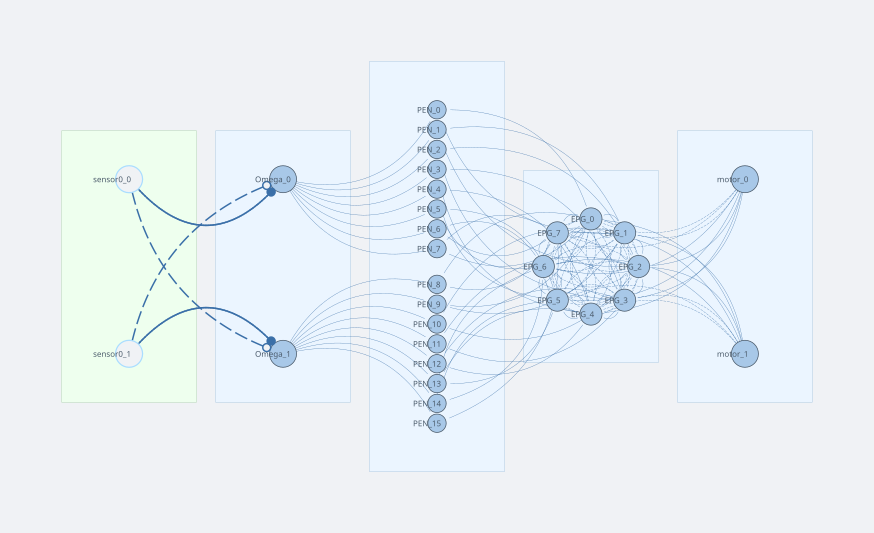

# RingAttractorBrain

**RingAttractorBrain** is a heading-direction vehicle. It maintains an internal compass — a stable activity bump in a ring attractor layer (`EPG`) — and keeps it anchored in world coordinates by integrating wheel velocity. The motor output is decoded from the bump position, producing a turn tendency proportional to the robot's current heading.

Load it from `simulation/2d/networks/RingAttractorBrain.json` via the network editor.

---

## Network diagram



---

## Sensors and layers

| Name | Type | n | Notes |
|------|------|---|-------|
| `sensor0` | ProprioceptiveSensor | 2 | Reads wheel velocity (left, right) from the `motor` joint; scale 0.01 |
| `Omega` | SumLayer | 2 | Computes differential velocity: Ω[0] = v_L − v_R, Ω[1] = v_R − v_L |
| `PEN` | LeakyLayer | 16 | Path-integration neurons split into two halves: neurons 0–7 shift the bump CCW, neurons 8–15 shift it CW |
| `EPG` | RingAttractorLayer | 8 | The heading-direction ring; supports one stable activity bump via Mexican-hat recurrent weights |
| `motor` | SumLayer | 2 | Left/right motor outputs; driven by EPG decoding |

---

## How the circuit works

### Ring attractor — the bump

`EPG` is a ring of 8 leaky-integrator neurons. The recurrent `EPG → EPG` connection has a Mexican-hat profile:

| Angular distance | Weight |
|-----------------|--------|
| ±1 (nearest neighbour) | +0.215 (excitation) |
| ±2 | −0.577 (inhibition) |
| ±3 | −0.599 (inhibition) |
| ±4 (antipodal) | −0.420 (inhibition) |

This kernel supports exactly one localised activity bump. A small additive noise (`noise_std = 0.0025`) breaks the initial symmetry so the bump settles at a random position on first run. Once formed, the bump is stable and represents the robot's estimate of its heading direction relative to the starting orientation.

### Path integration — shifting the bump with rotation

When the robot turns, the bump must rotate to stay fixed in world coordinates:

```
sensor0  ──×0.01──►  Omega  ──×5──►  PEN  ──×0.1──►  EPG (shift)
              velocity diff         L / R halves    +1 / −1 step
```

1. `sensor0` reads the wheel joint velocities [v_L, v_R].
2. `Omega` computes the signed angular velocity: Ω[0] = v_L − v_R (left-turn signal), Ω[1] = v_R − v_L (right-turn signal). Only the positive half is active at any moment (the `SumLayer` output passes through without a nonlinearity, but PEN has a ReLU and bias −0.3 which gates small inputs).
3. `Omega → PEN` (weight 5): Ω[0] drives PEN neurons 0–7, Ω[1] drives PEN neurons 8–15.
4. `EPG → PEN` (stacked identity): each PEN neuron also receives the current EPG activity of its corresponding ring cell. PEN thus tracks both the angular-velocity command and the current bump position.
5. `PEN → EPG` (shifted identity, weight 0.1): PEN[0–7] drives EPG with a +1-step cyclic shift (CCW); PEN[8–15] drives EPG with a −1-step shift (CW). A left turn activates the CCW shifters, a right turn activates the CW shifters. The bump tracks the robot's heading through space.

### Motor decoding — heading to motor command

`EPG → motor` applies a 2×8 weight matrix that projects the bump position onto two sinusoidal bases (one per motor):

```
mL = Σ_k  EPG[k] · cos(k·45° + φ_L)
mR = Σ_k  EPG[k] · cos(k·45° + φ_R)
```

The two rows are phase-shifted copies of a cosine, so the motor output is a 2D vector that rotates with the bump. When the bump points "forward" (initial heading), the difference mL − mR is zero and the robot drives straight. If the robot has turned and the bump has rotated accordingly, the decoding produces a left-right imbalance that steers the robot back toward the stored heading — a heading-hold behaviour.

---

## Bump formation conditions

Getting a ring attractor to form a single clean bump requires three conditions, all checkable in the weight editor:

### 1. Negative row sums (the most important one)

Every row of the `EPG → EPG` matrix must sum to a **negative** value. This ensures that globally uniform activity is suppressed: if all neurons fire equally, each receives net inhibitory input and activity falls until a localised bump is favoured.

Check the coloured row-sum strip on the right edge of the weight heatmap — all squares must be blue. Any red square means that row is net excitatory and the bump will not form.

In this network each row sums to ≈ −2.34. ✓

### 2. Input drive must be small

The tonic input reaching each ring neuron (= row sum of the driving weight matrix × driving amplitude) should be in the range 0.1–1.0. In this circuit `EPG` receives no external tonic drive; its `bias = 0.5` plays that role. PEN drives EPG only when the robot is actually turning.

A common failure: connecting a large ConstantLayer to EPG with an identity matrix of amplitude 1. Each ring neuron then receives a drive of **n × amplitude** (sum over the entire column), which overwhelms inhibition and pins all neurons to a uniform active state.

### 3. Excitatory width vs. neuron spacing

For a bump to exist, nearest-neighbour pairs must receive net excitatory input from each other. The nearest-neighbour spacing on a ring of n neurons is 2π/n radians. If the excitatory lobe of the kernel (sigma_exc of the Mexican hat) is narrower than this spacing, no excitation reaches immediate neighbours — the kernel becomes purely inhibitory and no bump is possible.

**Rule of thumb for n = 8:** spacing = 2π/8 ≈ 0.785 rad, so sigma_exc should be ≥ 0.9 rad (roughly 1.0–1.5 × spacing).

In this network the Mexican-hat was tuned to give +0.215 at distance 1, which is positive — condition satisfied. ✓

### 4. Two-bump problem

If two bumps appear instead of one, the k = 2 Fourier mode of the kernel dominates k = 1. This happens when sigma_exc is so narrow that nearest-neighbour excitation is weak while the second-neighbour inhibition is strong. The fix is to widen sigma_exc until the nearest-neighbour weight becomes clearly positive.

**Quick diagnostic:** open the Mexican-hat editor on the `EPG → EPG` connection, increase `sig_exc` in small steps and re-apply. When the nearest-neighbour weight turns positive (non-zero in the first off-diagonal), one-bump behaviour is restored.

---

## Behaviour to observe

1. Start the simulation. Within 1–2 s a single bump of activity appears in the EPG ring (visible in the network visualiser).
2. Drive the robot in a circle (use the WASD keys if a keyboard brain is active, or set `motor` to a constant left-right offset). The bump rotates in the EPG ring to counter-track the robot's turn.
3. Stop turning. The bump holds its world-fixed position — path integration has succeeded.
4. Enable noise on the `sensor0` sensor and watch the bump slowly drift over long runs (proprioceptive integration error accumulates).

---

## Parameter reference

### Bump formation

| Parameter | Current value | Effect | Risk if wrong |
|-----------|--------------|--------|---------------|
| `EPG.bias` | 0.5 | Tonic drive; sets uniform fixed point x* ≈ 0.15 | Too low: no bump. Too high: stuck at uniform state |
| `EPG→EPG` near-neighbour weight | +0.215 | Excites immediate neighbours; controls bump width | Too narrow: two-bump mode wins |
| `EPG→EPG` row sum | −2.34 | Net inhibition; keeps bump amplitude bounded | Too weak: runaway growth |
| `EPG.noise_std` | 0.0025 | Breaks symmetry from uniform state; seeds bump spontaneously | Too high: bump wanders. Zero: never forms |

### Bump stability

| Parameter | Current value | Effect | Risk if wrong |
|-----------|--------------|--------|---------------|
| `PEN→EPG` weight | 0.1 | Recurrent excitation fed back through PEN | Too large: exponential growth. Too small: no rotation |
| `PEN.bias` | −0.3 | Firing threshold — PEN only active when EPG > 0.3 | Too negative: PEN silent, no rotation possible |
| `EPG→PEN` weight | 1.0 | How faithfully PEN reads the bump | > 1 risks amplifying the EPG→PEN→EPG loop |

### Rotation speed and angular contingency

| Parameter | Current value | Effect | Calibration direction |
|-----------|--------------|--------|----------------------|
| `EPG.tau` | 0.025 s | Fundamental rotation timescale | ↓ faster ring rotation, ↑ slower |
| `PEN.tau_rise` / `tau_decay` | 0.1 s | PEN response lag — currently 4× slower than EPG, acts as bottleneck in the shift loop | Reduce toward `EPG.tau` for cleaner rotation |
| `Omega.scale` | 0.2 | Overall amplitude of angular velocity entering PEN | ↑ larger Omega drive |
| `Omega→PEN` weight | 5.0 | **Angular contingency knob** — sensitivity of the ring to turning; sets the threshold speed at which rotation activates | ↑ ring responds to slower turns; ↓ requires faster turns |
| `sensor0.scale` | 0.01 | Converts raw wheel velocity to sensor units | Part of the overall Omega chain gain |

The combined Omega chain gain is:

```
sensor_scale × Omega_scale × W_Omega_PEN = 0.01 × 0.2 × 5.0 = 0.01
```

### Linear regime condition

For bump rotation speed to be **proportional** to turning speed (rather than on/off), the Omega drive at PEN must not fully silence the inhibited group:

```
Omega_drive at PEN  <  EPG_peak − |PEN_bias|  ≈  0.68 − 0.3  =  0.38
```

At typical turning speeds the inhibited PEN group is fully silenced (system in saturation), so rotation speed is set by `EPG.tau` rather than Omega amplitude. This is biologically normal — the 8-neuron ring hops between discrete positions, and `Omega→PEN` acts as a sensitivity threshold. For analogue proportional control, either reduce `Omega.scale` so the inhibited group retains some activity, or increase `PEN.bias` to raise the threshold.
