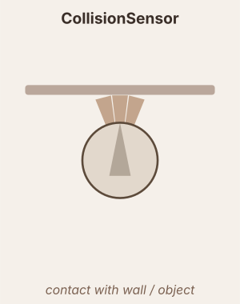

# CollisionSensor

Checks `n` arc sectors around the robot perimeter for wall or object contact.

## Sector layout

Sector centres are evenly distributed across `angle_spread`, symmetric around the robot heading:

$$c_i = \theta + \frac{\text{angle\_spread}}{2} - i \cdot \frac{\text{angle\_spread}}{n-1}, \quad i = 0 \ldots n-1$$

For `n=1` the single sector is centred on the heading.

## Probe geometry

Each sector samples $n_{pts} = \max(5, \lfloor \text{arc\_angle}_{deg} / 5 \rfloor)$ probe points along the arc at radius $r = r_{body} \times \text{radius}$:

$$p_k = \bigl(x + r\cos(a_k),\; y + r\sin(a_k)\bigr), \quad a_k \in \left[c_i - \tfrac{\text{arc\_angle}}{2},\; c_i + \tfrac{\text{arc\_angle}}{2}\right]$$

## Raw detection

$$h_i = \begin{cases}1 & \text{any probe in sector } i \text{ touches an obstacle} \\ 0 & \text{otherwise}\end{cases}$$

$$o_i = h_i \cdot \text{scale} + \text{bias} + h_i \cdot \text{noise\_std} \cdot \varepsilon_i, \quad \varepsilon_i \sim \mathcal{N}(0,1)$$

## Output pipeline

$$\tau = \begin{cases}\tau_{rise} & o_i > x \\ \tau_{decay} & o_i \leq x\end{cases}, \quad \frac{dx}{dt} = \frac{o_i - x}{\tau}$$

$$\text{output} = f(x) \quad (\text{or}\ f(o_i)\ \text{if no dynamics})$$

## Parameters

| Parameter | Description |
|---|---|
| `n` | Number of arc sectors (outputs) |
| `angle_spread` | Total angular span covered by all sectors (degrees) |
| `arc_angle` | Angular width of each individual sector (degrees) |
| `radius` | Probe radius as a multiplier on body radius (`1.0` = surface, `>1.0` = lookahead) |

## Neuromodulation

- `modulators` — list of `(name, scale, site)` triples. Multiplies the sensor output each tick by `1 + Σ (scale × signal)`.
  - `scale > 0` → excitatory; `scale < 0` → inhibitory.
