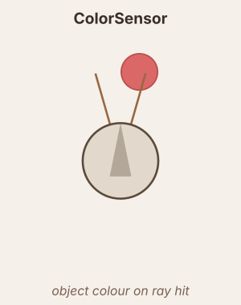

# ColorSensor

Casts `n` rays in a fan and detects solid coloured circular objects.

**Geometry:** same fan as `GradientSensor` — rays span `angle_spread` degrees around `center_angle`.

**Raw signal** (per ray `i`):

$$r_i = \text{object\_color}(\text{ray}_i,\; \text{channel}) \times \text{scale}$$

Returns 1.0 on a hit (0.0 otherwise) if no colour filter. `color_channel = 'R'/'G'/'B'` reads only that channel.

## Output pipeline

$$\tau = \begin{cases}\tau_{rise} & r > x \\ \tau_{decay} & r \leq x\end{cases}, \quad \frac{dx}{dt} = \frac{r - x}{\tau}$$

$$\text{output} = f(x) \quad (\text{or}\ f(r)\ \text{if no dynamics})$$

## Neuromodulation

- `modulators` — list of `(name, scale, site)` triples. Multiplies the sensor output each tick by `1 + Σ (scale × signal)`. The `site` field is accepted but not used — all modulators contribute a single gain.
  - `scale > 0` → excitatory (boosts sensitivity); `scale < 0` → inhibitory.
