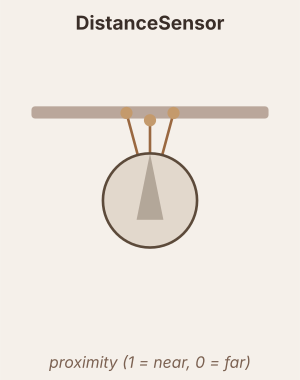

# DistanceSensor

Casts `n` rays outward in a fan. Output is normalised proximity: 1.0 = touching, 0.0 = at `max_range`.

## Raw signal

$$r_i = \max\!\left(0,\;1 - \frac{d_i}{\text{max\_range}}\right) \times \text{scale}$$

where $d_i$ is the distance to the nearest obstacle along ray $i$.

## Output pipeline

$$\tau = \begin{cases}\tau_{rise} & r > x \\ \tau_{decay} & r \leq x\end{cases}, \quad \frac{dx}{dt} = \frac{r - x}{\tau}$$

$$\text{output} = f(x) \quad (\text{or}\ f(r)\ \text{if no dynamics})$$

## Parameters

| Parameter | Description |
|---|---|
| `angle_spread` | Total angular fan width in degrees |
| `max_range` | Rays beyond this distance read 0 |

## Neuromodulation

- `modulators` — list of `(name, scale, site)` triples. Multiplies the sensor output each tick by `1 + Σ (scale × signal)`.
  - `scale > 0` → excitatory; `scale < 0` → inhibitory.
