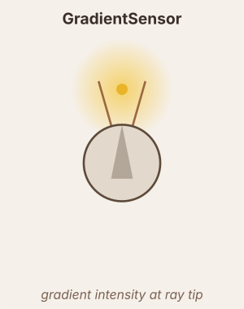

# GradientSensor

Casts `n` rays in a fan and reads gradient intensity at each tip.

$$\alpha_i = \text{center\_angle} + \text{fan}(i, n, \text{angle\_spread})$$

$$p_i = \bigl(x + d\cos(\theta+\alpha_i),\; y + d\sin(\theta+\alpha_i)\bigr)$$

$$r_i = \text{gradient}(p_i,\; \text{label}) \times \text{scale}$$

`gradient = ''` — responds to all labels. `color_channel = 'R'/'G'/'B'` — single channel.

## Output pipeline

$$\tau = \begin{cases}\tau_{rise} & r > x \\ \tau_{decay} & r \leq x\end{cases}, \quad \frac{dx}{dt} = \frac{r - x}{\tau}$$

$$\text{output} = f(x) \quad (\text{or}\ f(r)\ \text{if no dynamics})$$

## Neuromodulation

- `modulators` — list of `(name, scale, site)` triples. Multiplies the sensor output each tick by `1 + Σ (scale × signal)`. The `site` field is accepted but not used — all modulators contribute a single gain.
  - `scale > 0` → excitatory (boosts sensitivity); `scale < 0` → inhibitory.
