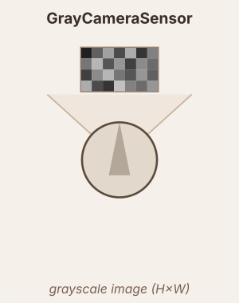

# GrayCameraSensor

Raycasts `width × height` pixels across the field of view and returns luminance.

## Per-pixel luminance

$$\text{pixel}_i = \frac{R_i + G_i + B_i}{3}$$

## Output shape

$$\text{output} \in \mathbb{R}^{H \times W} \quad \text{(flat row-major)}$$

## Lateralized mode

`lateralized=True` splits the frame at the horizontal midline (with `overlap` pixels):

$$\text{sensor\_L} \in \mathbb{R}^{H \times (W/2 + \text{overlap})}, \quad \text{sensor\_R} \in \mathbb{R}^{H \times (W/2 + \text{overlap})}$$

Each half connects to its own `Conv2dLayer` (`_L` / `_R` pair). Connect to a `Conv2dLayer` to apply 2-D filters, or use the flat vector directly.

## Parameters

| Parameter | Default | Description |
|-----------|---------|-------------|
| `width` | 64 | Number of rays (horizontal resolution) |
| `height` | 48 | Tile rows (1 = single strip) |
| `fov` | 90° | Horizontal field of view |
| `center_angle` | 0° | Center offset from robot heading |
| `vertical_angle` | 0° | Camera tilt — positive = tilted down (ground), negative = tilted up (sky). Each image row sees a different ground distance: bottom rows closer, top rows farther. At 90° the camera points straight down and the image goes black. |
| `max_range` | 10.0 | Max ray length in world units |
| `lateralized` | False | Split output into left/right halves |
| `overlap` | 0 | Pixels past midline included in each half |
