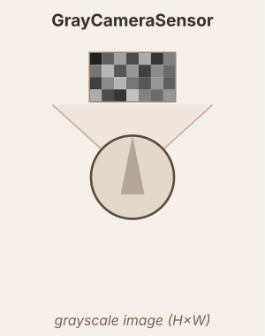

# GrayCameraSensor

MuJoCo renders a `width × height` perspective image from the robot's pose and the sensor returns its luminance.

## Frame rate

The camera renders `fps` frames per **simulated** second, so what the brain sees doesn't depend on simulation speed. Between frames the brain keeps the last output. With `fps = 0` the camera renders as fast as the app can (once per display update), without holding up the other sensors.

## Per-pixel luminance

$$\text{pixel}_i = \frac{R_i + G_i + B_i}{3}$$

## Output shape

Not lateralized: only the frame's **centre row** reaches the network,

$$\text{output} \in \mathbb{R}^{W}$$

The full `(H, W)` frame is still shown as the visualizer thumbnail. Use lateralized mode if a layer needs the whole image.

## Lateralized mode

`lateralized=True` splits the frame at the horizontal midline (with `overlap` pixels):

$$\text{sensor\_L} \in \mathbb{R}^{H \times (W/2 + \text{overlap})}, \quad \text{sensor\_R} \in \mathbb{R}^{H \times (W/2 + \text{overlap})}$$

Each half connects to its own `Conv2dLayer` (`_L` / `_R` pair). Connect to a `Conv2dLayer` to apply 2-D filters, or use the flat vector directly.

## Parameters

| Parameter | Default | Description |
|-----------|---------|-------------|
| `width` | 64 | Horizontal resolution (pixels) |
| `height` | 48 | Image rows (1 = single strip) |
| `fov` | 90° | Horizontal field of view |
| `center_angle` | 0° | Center offset from robot heading |
| `vertical_angle` | 0° | Camera tilt — positive = tilted down (ground), negative = tilted up (sky). At 90° the camera looks straight down at the floor. |
| `max_range` | 10.0 | Not used by the MuJoCo render (kept for saved networks) |
| `fps` | 60 | Frames per simulated second (0 = as fast as possible) |
| `lateralized` | False | Split output into left/right halves |
| `overlap` | 0 | Pixels past midline included in each half |
