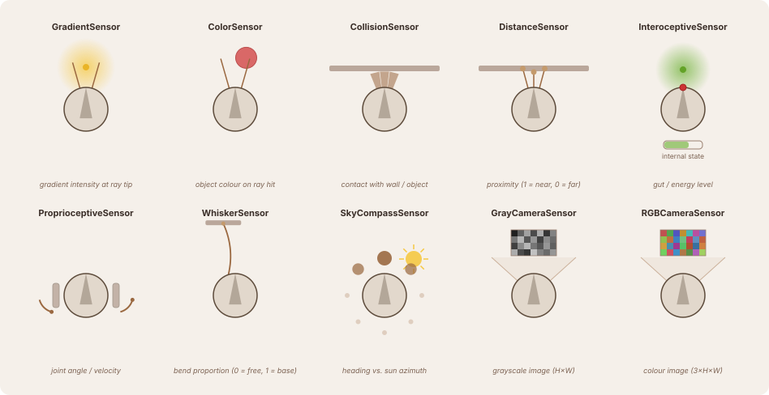

# Sensors

Each sensor reads a different aspect of the robot's environment and produces a vector of outputs the network can use. The diagram below shows all sensor types and the physical quantity each one measures.

Select a sensor from the left panel for full parameter reference and equations.
