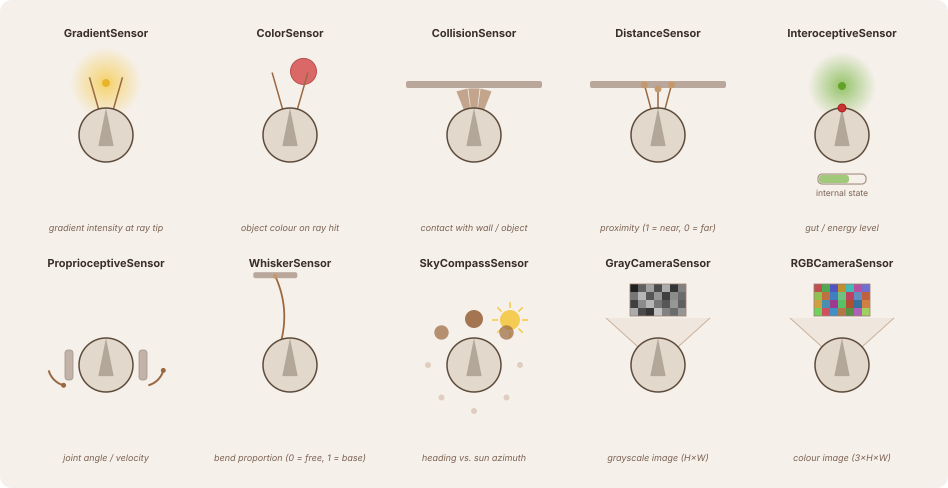

# Sensors

Each sensor reads a different aspect of the robot's environment and produces a vector of outputs the network can use. The diagram below shows all sensor types and the physical quantity each one measures.

Select a sensor from the left panel for full parameter reference and equations.

## Settings every sensor shares

Every sensor's reading goes through the same steps as a neuron layer, in this order: `bias` → noise (`noise_std`, `noise_tau`, see [Noise](../layers/leaky.md#noise)) → `output_mode` (derivative or integral of the reading) → leaky filter (`tau_rise`, `tau_decay`) → `activation` → `scale`.

The time constants follow the same rules as layers:

| Setting | Meaning |
|---|---|
| `tau_rise` 0 or blank | No filtering — the reading passes straight through (whatever `tau_decay` says) |
| `tau_decay` 0 or blank | Rise-and-hold — the output rises toward the reading but never decays |
| both set | Rises with `tau_rise`, falls with `tau_decay` |

With `output_mode = derivative`, the output is 0 on the first step, since there is no previous reading yet.
