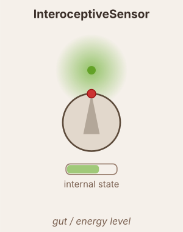

# InteroceptiveSensor

Samples gradient intensity at the **mouth** (heading angle 0) and integrates it over time as an internal energy/satiation state.

## Pipeline

**1. Sample** — $r \in [0,1]$: maximum gradient intensity within `body_radius` of the mouth point.

**2. Scale & clip:**

$$s_{\text{target}} = \text{clip}(r \times \text{scale},\; 0,\; 1) \times \text{max\_val}$$

- `scale` controls mouth sensitivity. At `scale=1` full-intensity gradient drives state all the way to `max_val`.
- `max_val` is the ceiling of the internal state.

**3. Integrate** — asymmetric leaky dynamics toward the target:

$$\tau = \begin{cases}\tau_{rise} & s_{\text{target}} > s \\ \tau_{decay} & s_{\text{target}} \leq s\end{cases}, \qquad \frac{ds}{dt} = \frac{s_{\text{target}} - s}{\tau}$$

- `tau_rise` — seconds to reach satiation when food is at the mouth.
- `tau_decay` — seconds to return to zero when food is absent (should be >> `tau_rise` for realistic hunger).

**4. Clip & output:**

$$\text{output} = \text{clip}(s,\; 0,\; \text{max\_val}) + \text{bias}$$

- `start_val` — initial value of $s$ at reset (0 = empty stomach, `max_val` = full).
- `bias` — constant offset added every tick. Use negative to encode a hunger drive.

## Neuromodulation

- `neuromodulator_transmitter` — if set, publishes the sensor's output to the neuromodulator bus (e.g. `"satiety"`).
- `neuromodulator_color` — hex color used in the network visualizer.
- `modulators` — list of `(name, scale, site)` triples. Multiplies the sensor output by `1 + Σ (scale × signal)`.
  - `scale > 0` → excitatory; `scale < 0` → inhibitory.
