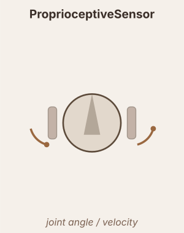

# ProprioceptiveSensor

Reads joint angle or angular velocity and optionally applies leaky dynamics. `n` is set automatically from the number of joints in the named group.

## Raw signal

$$r_i = \text{joint}_i.\text{angle} \times \text{scale} \quad (\text{or velocity if use\_velocity=True})$$

## Output pipeline

$$\tau = \begin{cases}\tau_{rise} & r > x \\ \tau_{decay} & r \leq x\end{cases}, \quad \frac{dx}{dt} = \frac{r - x}{\tau}$$

$$\text{output} = f(x) \quad (\text{or}\ f(r)\ \text{if no dynamics})$$

## Parameters

| Parameter | Description |
|---|---|
| `joint_id` | `motor_layer_name` of the joint group. Mirrored wheel pair → `n=2`; single head joint → `n=1` |
| `use_velocity` | `True` to read angular velocity instead of angle |

## Neuromodulation

- `modulators` — list of `(name, scale, site)` triples. Multiplies the sensor output each tick by `1 + Σ (scale × signal)`.
  - `scale > 0` → excitatory; `scale < 0` → inhibitory.
