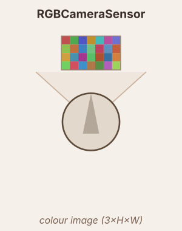

# RGBCameraSensor

MuJoCo renders a `width × height` perspective image from the robot's pose and the sensor returns its RGB colour (same rendering and `fps` frame rate as [`GrayCameraSensor`](graycamera.md), all 3 channels retained).

## Output shape (channels-first / CHW)

$$\text{output} \in \mathbb{R}^{3 \times H \times W} \quad \text{(flat: channel, row, col)}$$

## Lateralized mode

`lateralized=True`:

$$\text{sensor\_L} \in \mathbb{R}^{3 \times H \times (W/2 + \text{overlap})}, \quad \text{sensor\_R} \in \mathbb{R}^{3 \times H \times (W/2 + \text{overlap})}$$

Connect to a `Conv2dLayer` with `in_ch=3` (set automatically from camera mode).

## Parameters

| Parameter | Default | Description |
|-----------|---------|-------------|
| `width` | 64 | Horizontal resolution (pixels) |
| `height` | 48 | Image rows (1 = single strip) |
| `fov` | 90° | Horizontal field of view |
| `center_angle` | 0° | Center offset from robot heading |
| `vertical_angle` | 0° | Camera tilt — positive = tilted down (ground), negative = tilted up (sky). At 90° the camera looks straight down at the floor. |
| `max_range` | 10.0 | Not used by the MuJoCo render (kept for saved networks) |
| `fps` | 60 | Frames per simulated second (0 = as fast as possible) |
| `lateralized` | False | Split output into left/right halves |
| `overlap` | 0 | Pixels past midline included in each half |
