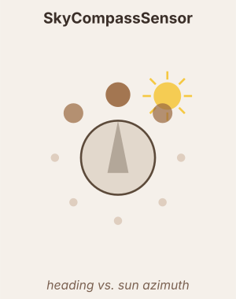

# SkyCompassSensor

Encodes the robot's heading relative to the sun via a cosine tuning curve, mimicking insect dorsal rim area (DRA) photoreceptors.

Requires `world.sky["enabled"] = True`.

## Tuning curve

Per neuron `k`:

$$r_k = \cos\!\left(\theta - \phi_{\text{sun}} - \phi_0 - k \cdot \frac{2\pi}{n}\right) \times \text{scale}$$

where $\phi_{\text{sun}} = \text{sky.angle} + \pi/2$ (perpendicular to e-vector bars) and $\phi_0$ = `phase`.

## Output pipeline

$$\tau = \begin{cases}\tau_{rise} & r > x \\ \tau_{decay} & r \leq x\end{cases}, \quad \frac{dx}{dt} = \frac{r - x}{\tau}$$

$$\text{output} = f(x) \quad (\text{or}\ f(r)\ \text{if no dynamics})$$

## Parameters

| Parameter | Description |
|---|---|
| `n` | Number of DRA neurons (heading directions sampled) |
| `phase` | Rotates neuron 0 to align with a reference direction |
| `derivative` | `True` → fires on falling edges (heading change detection) |
| `noise_std` / `noise_tau` | Additive Ornstein–Uhlenbeck noise on raw signal |

## Neuromodulation

- `modulators` — list of `(name, scale, site)` triples. Multiplies the sensor output each tick by `1 + Σ (scale × signal)`.
  - `scale > 0` → excitatory; `scale < 0` → inhibitory.
