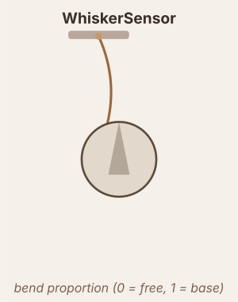

# WhiskerSensor

Casts a ray from a mount point along the body heading. Output is bending proportion: 0 = no contact, 1 = contact at the base.

## Mount pose

$$\text{origin} = \bigl(x + d_m\cos(\theta + \alpha_m),\; y + d_m\sin(\theta + \alpha_m)\bigr)$$

where $d_m$ = `mount_dist`, $\alpha_m$ = `mount_angle`.

## Raw signal

$$r = \text{clip}\!\left(\frac{\text{length} - d}{\text{length}},\; 0,\; 1\right) \times \text{scale}$$

where $d$ = distance to first obstacle. If no contact: $r = 0$.

## Output pipeline

$$\tau = \begin{cases}\tau_{rise} & r > x \\ \tau_{decay} & r \leq x\end{cases}, \quad \frac{dx}{dt} = \frac{r - x}{\tau}$$

$$\text{output} = f(x) \quad (\text{or}\ f(r)\ \text{if no dynamics})$$
