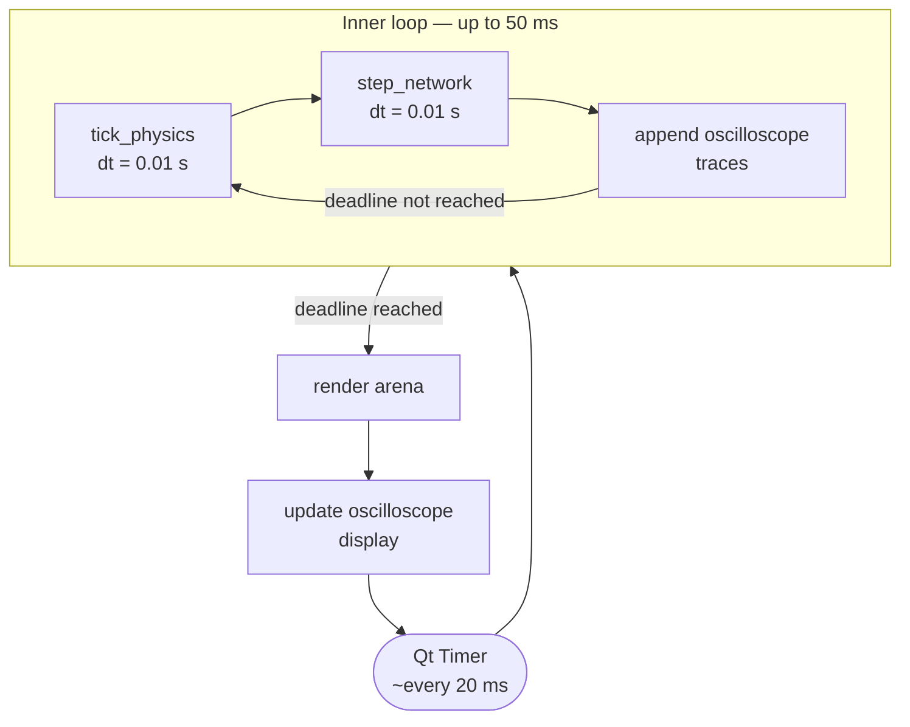
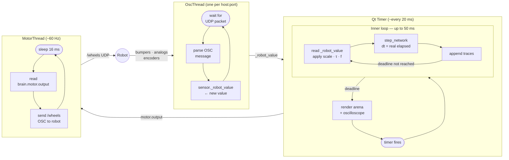

# Timing Architecture

The 2D simulator separates **physics/network stepping** from **display rendering** — and in real-robot mode, also from **sensor I/O** and **motor output**. This page describes the timing loops for both modes.

---

## Simulation mode

Because the inner loop runs many steps before handing control back to the GUI, the **network executes at ~200+ steps/s** (depending on step cost) while the **display updates at ~14 Hz**.

| Component | Typical rate |
|---|---|
| Qt timer fires | ~14 Hz |
| `tick_physics` + `step_network` | ~230 Hz |
| Arena repaint | ~14 Hz |
| Oscilloscope update | ~14 Hz |

---

## Real-robot mode

Three concurrent activities share the process. Each runs at its own rate, independent of the others.

| Thread | Rate | Driven by |
|---|---|---|
| OscThread | robot send rate (~60 Hz) | incoming UDP packets |
| Qt loop — network | ~230 Hz | 50 ms deadline |
| MotorThread | ~60 Hz | fixed 16 ms sleep |

---

!!! note "Thread safety"
    The simulator relies on Python's GIL rather than explicit locks. Attribute reads and writes on primitive types are atomic at the bytecode level, which is sufficient here:

    - **Sensor values** — `OscThread` writes `sensor._robot_value`; the Qt thread reads it. A stale read is harmless: the value is at most one robot transmission cycle old.
    - **Motor commands** — `MotorThread` reads `brain.motor.output` every 16 ms; the Qt thread writes it after each network step. In the worst case the robot receives a command one network step stale — well within motor latency tolerance.
    - **Display** — all rendering happens on the Qt thread; no cross-thread writes occur there.

    If you add state involving multi-attribute invariants (e.g. a weight matrix updated atomically with a bias vector), protect it with a `threading.Lock`.
