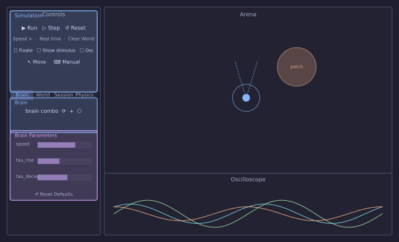

# Tour of the Simulator

This page is a reference for every panel and control in the window. Other tutorials link here instead of re-explaining where things are.

## Launching { #launching }

```bash
python LBPSimulator.py
```

The window opens with the robot centred in an empty arena. Nothing moves until you press [Run](#run-stop).

---

## Window layout { #layout }



| Area | Default position | Can be… |
|------|-----------------|---------|
| [Arena](#arena) | Centre | Fixed |
| [Controls](#controls) | Left dock | Detached, resized |
| [Oscilloscope](#oscilloscope) | Bottom dock | Detached, resized |

---

## Arena { #arena }

The main simulation view. The robot is the filled circle with sensor rays. Gradient patches appear as coloured halos; solid objects as filled circles.

### Navigating { #arena-nav }

Scroll to zoom. Middle-click-drag to pan. The arena resets its view when you press [Reset](#reset).

### Trail { #trail }

The robot's path is drawn as a fading line. Toggle it with the [Trail checkbox](#trail-checkbox) in the World tab; adjust its length with the **Len** spinner next to it.

---

## Controls panel { #controls }

The left dock. Contains a **Simulation** group at the top followed by four tabs: [Brain](#brain-tab), [World](#world-tab), [Session](#session-tab), [Physics](#physics-tab).

### Simulation group { #simulation-group }

All simulation controls live in one group with no sub-sections.

| Control | What it does |
|---|---|
| **▶ Run / ■ Stop** { #run-stop } | Start or stop the simulation loop. The [status bar](#status-bar) shows **RUNNING** or **STOPPED**. |
| **⏭ Step** { #step } | Advance exactly one physics tick while stopped — useful for frame-by-frame inspection. |
| **↺ Reset** { #reset } | Stop and return the robot to its start position and heading. Brain state is cleared; world patches are not. |
| **Speed ×** { #speed-mult } | How many physics ticks run per render frame. Higher values speed up exploration; very high values can make physics unstable. |
| **Real time** { #real-time } | Run only as many ticks per frame as wall-clock time demands — keeps the simulation at 1× biological speed. |
| **✕ Clear World** { #clear-world } | Remove all patches, objects, and walls without touching the robot or brain. |
| **Fixate** { #fixate } | Freeze the robot's position. Physics and the brain still run — useful for probing sensor responses without the robot moving. |
| **Show stimulus** { #show-stimulus } | Toggle gradient patches on/off. When off, sensors read zero even though patches remain visible. |
| **Oscilloscope** { #osc-toggle } | Show or hide the [Oscilloscope](#oscilloscope) dock. |
| **↖ Move** { #move-mode } | Toggleable. While active, drag patches, objects, or the robot to a new position. Press again or **Escape** to exit. |
| **⌨ Manual** { #manual-mode } | Drive the robot with the keyboard while the brain keeps running. `W`/`S` = forward/back, `A`/`D` = turn, `Space` = stop. |

---

## Brain tab { #brain-tab }

### Brain selector { #brain-selector }

A drop-down listing every Python file found in `brains/`. Select a brain to load it; the [Brain Parameters](#brain-parameters) group below updates to show its [Params](coding-brains.md#creating-your-brain-file).

### ⟳ Reload { #reload }

Re-imports the currently selected brain file from disk. Use this after editing the file — no need to restart the simulator. Brain state is reset as if you pressed [Reset](#reset).

### + New network { #new-network }

Creates a new empty network JSON file and opens it in the [Network visualizer](#network-viz). Only visible when the selected brain supports network files.

### ⬡ Network visualizer { #network-viz }

Opens the network editor window, which shows the brain's layers and connections as an interactive graph. You can add layers, draw connections, and edit weight matrices live — changes take effect immediately without reloading.

### Brain Parameters { #brain-parameters }

Auto-generated from the brain's [`Param`](coding-brains.md#creating-your-brain-file) descriptors. Each slider controls one parameter in real time. The **↺ Reset Defaults** button at the bottom restores all sliders to their coded defaults.

---

## World tab { #world-tab }

### Trail { #trail-checkbox }

Enables or disables the position trail drawn in the [Arena](#arena). The **Len** spinner sets how many past positions are kept (10–5000).

### Arena shape { #arena-shape }

**Square** (default) — the robot bounces off four flat walls.
**Round** — the arena is a circular boundary; bumpers trigger when the robot reaches the edge.

### Gradient patches { #gradient-patches }

Gradient patches are circular fields that sensors can detect. Each patch has a colour channel (A–F) and a spatial falloff.

**To add a patch** — click one of the letter buttons (A–F) then click a position in the [Arena](#arena). A new patch appears at that location. { #add-patch }

**Wall** — adds a wall-proximity gradient that increases as the robot approaches any boundary. { #wall-patch }

**To move a patch** — enable [↖ Move](#move-mode) and drag it. { #move-patch }

**To delete a patch** — enable [↖ Move](#move-mode), click the patch to select it, then press **Delete**. { #delete-patch }

### Solid objects { #objects }

Solid circles that the robot physically cannot pass through. Added the same way as gradient patches using the **Z–U** buttons. The robot's bumper sensors fire on contact.

---

## Session tab { #session-tab }

### Sessions { #sessions }

Saves and loads the complete state of the world: gradient patches, objects, arena shape, simulation speed, and the current brain's parameter values. Sessions are stored as JSON files in `configs/`.

**Name** — the filename (without `.json`) for the next save.
**Save** — writes the current state to `configs/<name>.json`.
**Load** — the drop-down lists all saved configs; selecting one loads it immediately.

### Task { #task }

A secondary selector for pre-defined evaluation scenarios. Select a task and press **Apply** to set up a standardised world layout.

### Logger { #logger }

Records sensor and motor data to a timestamped CSV file during a run.

**● Record** — starts logging. The label updates with the output path.
**■ Stop** — stops logging and closes the file.

---

## Physics tab { #physics-tab }

Exposes the raw simulation parameters defined in `SimConfig`: `dt`, `arena_scale`, `motor_gain`, `sense_radius`, `sensor_angle`, `body_radius`, and others. Changing these takes effect on the next [Reset](#reset).

---

## Oscilloscope { #oscilloscope }

A scrolling time-series plot docked at the bottom. It displays the variables returned by the active brain's `plots()` method. Each channel gets its own colour; the multiplier spinner next to each channel label scales the display amplitude.

To add signals to the oscilloscope, return their attribute names from `plots()` in your brain:

```python
def plots(self):
    return ['mL', 'mR', 'smooth']   # any numeric attribute or layer name
```

The oscilloscope samples the listed names after every `loop()` call.

---

## Status bar { #status-bar }

A thin bar at the very bottom of the window. Shows:

- **■ STOPPED** or **● RUNNING** — current simulation state.
- Step time and speed multiplier on the right, updated each render frame.
