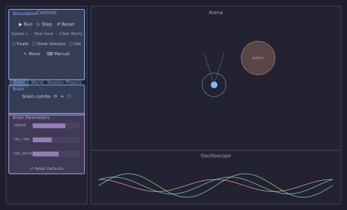

# Tour of the Simulator

This page is a reference for every panel and control in the window. Other tutorials link here instead of re-explaining where things are.

## Launching { #launching }

```bash
python LBPSimulator.py
```

The window opens with the robot centred in an empty arena. Nothing moves until you press [Run](#run-stop).

---

## Window layout { #layout }



| Area | Default position | Can be… |
|------|-----------------|---------|
| [Arena](#arena) | Centre | Fixed |
| [Controls](#controls) | Left dock | Detached, resized |
| [Oscilloscope](#oscilloscope) | Bottom dock | Detached, resized |

---

## Arena { #arena }

The main simulation view. The robot is the filled circle with sensor rays. Gradient patches appear as coloured halos; solid objects as filled circles.

### Navigating { #arena-nav }

Scroll to zoom. Middle-click-drag to pan. The arena resets its view when you press [Reset](#reset).

### Trail { #trail }

The robot's path is drawn as a fading line. Toggle it with the [Trail checkbox](#trail-checkbox) in the World tab; adjust its length with the **Len** spinner next to it.

---

## Controls panel { #controls }

The left dock. Contains a **Simulation** group at the top followed by four tabs: [Brain](#brain-tab), [World](#world-tab), [Session](#session-tab), [Physics](#physics-tab).

### Simulation group { #simulation-group }

Two columns: **▶ Run**, **⏭ Step** and **↺ Reset** stacked on the right; on the left three rows — **Time**, **Options** and **Visualization**. The options are toggle buttons (light blue when on).

| Control | What it does |
|---|---|
| **▶ Run / ⏸ Pause** { #run-stop } | Run, or pause where everything is — Run again continues from there. To start over, press **↺ Reset**, then Run. The [status bar](#status-bar) shows **RUNNING**, **PAUSED** or **STOPPED** (after a reset). |
| **⏭ Step** { #step } | Advance exactly one physics tick while stopped — useful for frame-by-frame inspection. |
| **↺ Reset** { #reset } | Stop and return the robot to its start position and heading. Brain state is cleared; world patches are not. |
| **Speed ×** { #speed-mult } | *Time row.* How many physics ticks run per render frame (default 200). Higher runs faster than real time without changing the results — the time step stays the same, the screen just updates less often. Greyed out while Real time is on (the tooltip says so). Every control in this group explains itself in a tooltip. |
| **Real time** { #real-time } | *Time row.* Run only as many ticks per frame as wall-clock time demands — keeps the simulation at 1× biological speed. |
| **📌 Fixate** { #fixate } | *Options row.* Hold the robot in place. Physics and the brain still run — useful for probing sensor responses without the robot moving. |
| **⌨ Manual** { #manual-mode } | *Options row.* Drive the robot with the keyboard while the brain keeps running. `W`/`S` = forward/back, `A`/`D` = turn, `Space` = stop. |
| **🤖 Robot** { #real-robot } | *Options row.* Switch to the real robot: live sensor input and motor output over the network instead of the simulated body (see the Robot tab). |
| **Hide stim** { #show-stimulus } | *Visualization row.* Hide the gradient patches; sensors then read zero even though the patches still exist. |
| **Osc** { #osc-toggle } | *Visualization row.* Show or hide the [Oscilloscope](#oscilloscope) dock. |

**↖ Move** and **✕ Clear World** are in the [World tab](#world-tab), on the Arena row.

### Keyboard shortcuts { #shortcuts }

**Ctrl+Space** runs / pauses, **Ctrl+→** steps one tick and **Ctrl+R** resets — from any window of the app (main window, network visualizer, oscilloscope). The small **?** next to the *Simulation* title — or **F1** from any window — opens a panel with every keyboard and mouse interaction, one tab per scope: **Everywhere**, **Arena** (tools, drags, right-click delete, zoom), **Network** (connect by dragging a node onto another, Alt+drag to move, palette, undo / copy / paste) and **Side view**. Keys are unique across the app — while ⌨ Manual is on, W/A/D drive the robot and don't pick world tools.

Next to **?** is **🔄**, shown only in a copy installed from the public repository: hover for the current version, click to check for updates. It checks quietly at start-up too, turning green with the new version number in its tooltip when one is available. An update replaces the app's own files and leaves your folder alone; restart afterwards.

---

## Brain tab { #brain-tab }

### Agents { #agents }

One row per group of agents. The **Brain** column shows what the group runs: the code brain's name, or **⬡ file.json** for a network.

### Code brain / Network { #brain-mode }

Each group runs either a **Code brain** — a Python class from `brains/` — or a **Network** — a circuit saved as JSON in `networks/` and designed in the [Network visualizer](#network-viz). Both come built-in (🔒, read-only) or from [your files folder](#my-files). The two toggles switch the selected group between them; switching back to Code brain restores the group's last code brain. Old sessions open in the right mode automatically.

### Brain selector { #brain-selector }

*Code brain mode.* A drop-down listing the Python brains found in `brains/` (built-in ones and yours). Select a brain to load it; the [Brain Parameters](#brain-parameters) group below updates to show its [Params](coding-brains.md#creating-your-brain-file).

### ⟳ Reload { #reload }

*Code brain mode.* Re-imports the currently selected brain file from disk. Use this after editing the file — no need to restart the simulator. Brain state is reset as if you pressed [Reset](#reset). **+** scaffolds a new brain file.

### Project and Network { #new-network }

*Network mode.* **Project** first chooses **My files** (your [files folder](#my-files)) or **🔒 Simulator** (the read-only networks that ship with the app), then a project folder in it — Default, Demos or Tutorials under Simulator, yours under My files (**+** creates one); **Network** picks the circuit file in it (**+** creates a new one with just a motor layer, always in your folder). Selecting a file loads it into the group. Saving a built-in network from the network window writes your own copy.

### ⬡ Open visualizer { #network-viz }

*Network mode.* Opens the network editor window, which shows the circuit's layers and connections as an interactive graph. It is always editable: drag chips from the palette on the left (**Palette** shows / hides it) to add sensors and layers, drag a node onto another to connect them, Alt+drag to move a node, double-click for its properties, right-click for everything else (weights, mute, remove, oscilloscope, activation / weight panels). Click a node to select it and highlight its connections; drag empty space to pan. Changes take effect immediately without reloading, and **Undo** / Ctrl+Z reverts any edit. **🔒 Lock** stops moving, connecting, adding and removing — properties and the view options still work. The `motor` layer drives the wheels: every network has one (a file without it gets one on load), and it can't be removed or renamed, nor its size changed. There is one visualizer; it follows the selected group, and its title names the group and file.

### Brain Parameters { #brain-parameters }

Auto-generated from the brain's [`Param`](coding-brains.md#creating-your-brain-file) descriptors. Each slider controls one parameter in real time. The **↺ Reset Defaults** button at the bottom restores all sliders to their coded defaults.

---

## World tab { #world-tab }

### World file { #world-file }

Saves and loads the arena state — gradient patches, objects, walls, sky, arena shape, and
floor texture — independently of any session or brain, the same way brains are stored as
files in `brains/`. World files are stored as flat JSON in `worlds/` — built-in ones and those in [your files folder](#my-files).

**World dropdown** — lists all saved worlds; selecting one loads it immediately.
**Save** — prompts for a name and writes the current arena state to `worlds/<name>.json` in your files folder.

### Floor { #floor }

A dropdown selecting the floor texture, drawn from `textures/` (see [Textures](#textures)
below). **(default)** keeps the built-in checker floor. Floor texture is visible in the
MuJoCo camera view, not the flat 2D canvas.

### Textures { #textures }

Texture images live as flat PNG files in `textures/`, discovered and picked the same way
brain files are — drop a new PNG into the `textures/` folder of your files folder and it appears in the Floor dropdown
and the Objects texture picker on next refresh. A few starter textures (checkerboard, grid,
noise) ship by default.

Textures render in the MuJoCo 3D camera view only — the flat 2D canvas marks a
textured object or wall with a white fill and a few diagonal lines instead of the actual
image, since it has no 3D renderer of its own.

### Trail { #trail-checkbox }

Enables or disables the position trail drawn in the [Arena](#arena). The **Len** spinner sets how many past positions are kept (10–5000).

### Arena shape { #arena-shape }

**Square** (default) — the robot bounces off four flat walls.
**Round** — the arena is a circular boundary; bumpers trigger when the robot reaches the edge.

**↖ Move** — toggle at the end of the Arena row. While active, drag patches, objects, or any robot to a new position. Selecting a gradient / object / wall / sky tool switches it off.
{ #move-mode }

**✕ Clear World** — removes all gradient patches and objects (walls stay), after asking for confirmation.
{ #clear-world }

### Gradient patches { #gradient-patches }

Gradient patches are circular fields that sensors can detect. Each patch has a colour channel (A–F) and a spatial falloff.

**To add a patch** — click one of the letter buttons (A–F) then click a position in the [Arena](#arena). A new patch appears at that location.
{ #add-patch }

**Wall** — adds a wall-proximity gradient that increases as the robot approaches any boundary.
{ #wall-patch }

**To move a patch** — enable [↖ Move](#move-mode) and drag it.
{ #move-patch }

**To delete a patch** — enable [↖ Move](#move-mode), click the patch to select it, then press **Delete**.
{ #delete-patch }

### Solid objects { #objects }

Solid circles that the robot physically cannot pass through. Added the same way as gradient patches using the **Z–U** buttons. The robot's bumper sensors fire on contact. The texture dropdown next to the colour swatches assigns a texture (see [Textures](#textures)) to new objects and to polygon walls drawn afterward; the **…** picker sets a custom colour independently of texture.

---

## Session tab { #session-tab }

### Your files { #my-files }

Everything you make — sessions, networks, worlds, motifs, brains, logs and videos — lives in **your files folder**, `~/LBPSimulator` by default (`LBPSimulator` in your home folder). Updates never touch it. The **My files** row at the top of the Sessions group shows where it is (hover for the full path); **📂** opens it in the file explorer, **…** picks another folder and **↺** goes back to the default.

The simulator also ships **built-in** sessions and networks (Tutorials, Demos, Default). The folder pickers list them under **🔒 Simulator**, next to **My files**; they are read-only: open and run them freely; saving one writes a copy into your folder instead (same subfolder name). Updates replace the built-in files.

### Sessions { #sessions }

Saves and loads the complete state of the world: gradient patches, objects, arena shape, simulation speed, and the current brain's parameter values. Sessions are stored as JSON files.

**Directory** — first choose **My files** or **🔒 Simulator** (the read-only sessions that ship with the app), then a folder in it: Tutorials or Demos under Simulator; **(top level)** or one of your folders under My files (**+** creates one there).
**Name** — the filename (without `.json`) for the next save.
**Save** — writes the current state to the selected folder; the status bar confirms it. With a Simulator folder selected, it saves to the folder of the same name in **My files** instead.
The app also saves its state to `latest_session.json` in your files folder when it closes and reopens from it next time.
**Load** — the drop-down lists all saved configs; selecting one loads it immediately.

### Task { #task }

A secondary selector for pre-defined evaluation scenarios. Select a task and press **Apply** to set up a standardised world layout.

### Logger { #logger }

Records sensor and motor data to a timestamped CSV file during a run.

**● Record** / **■ Stop** — start and stop logging; **Visualize trajectories** opens the recorded run in the trajectory viewer. While logging, the status bar shows a **● REC** indicator.

### Video { #video }

Records the arena view as an H.264 `.mp4` file, ready to drop straight into a slide deck. If the Network Visualizer window is open when recording starts, it is captured to a second, independent `.mp4` file at the same time. Files are written to `logs/videos/` in your [files folder](#my-files).

**Name** — base filename; each output file gets an `_arena` or `_network` suffix.
**Add timestamp** — when checked, inserts a date-time stamp between the base name and the suffix so repeated recordings don't overwrite each other.
**Auto (Run/Stop)** — when checked, recording starts automatically when the main **▶ Run** button starts the simulation and stops automatically when it is paused or reset, instead of using the Record/Stop buttons here.
**Speed** — playback speed multiplier (default 1×). Frames are always grabbed at a fixed real-time rate; Speed instead changes the frame rate stored in the file, so e.g. 2× plays back twice as fast and 0.5× is slow motion, with no dropped or duplicated frames.
**● Record** / **■ Stop** — start and stop capture manually. While recording, the status bar shows a **● REC** indicator (combined with the Logger's, if both are active).

Requires the optional `imageio` / `imageio-ffmpeg` packages (see `requirements.txt`); without them, Record shows an error dialog instead of a file.

---

## Physics tab { #physics-tab }

Exposes the raw simulation parameters defined in `SimConfig`: `dt`, `arena_scale`, `motor_gain`, `sense_radius`, `body_radius`, and others. Changing these takes effect on the next [Reset](#reset).

---

## Oscilloscope { #oscilloscope }

A scrolling time-series plot docked at the bottom. It displays the variables returned by the active brain's `plots()` method. Each channel gets its own colour; the multiplier spinner next to each channel label scales the display amplitude.

To add signals to the oscilloscope, return their attribute names from `plots()` in your brain:

```python
def plots(self):
    return ['mL', 'mR', 'smooth']   # any numeric attribute or layer name
```

The oscilloscope samples the listed names after every `loop()` call.

---

## Status bar { #status-bar }

A thin bar at the very bottom of the window. Shows:

- **● RUNNING**, **⏸ PAUSED** or **■ STOPPED** (reset, back at the start) — current simulation state.
- Step time and speed multiplier on the right, updated each render frame.
