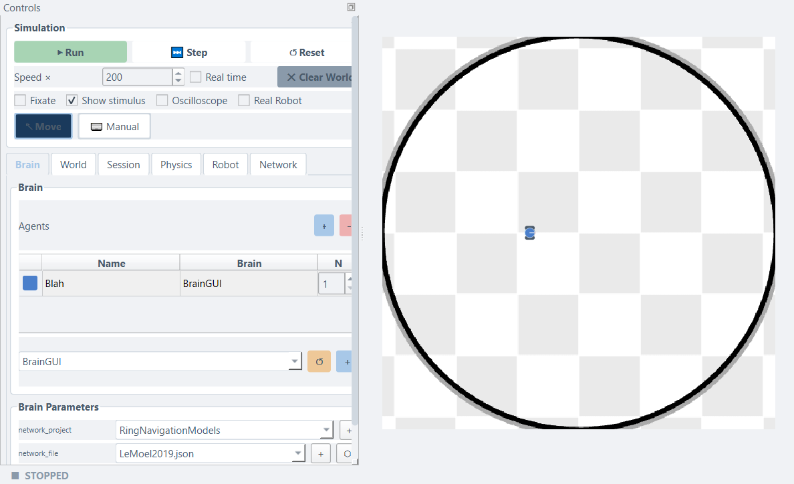
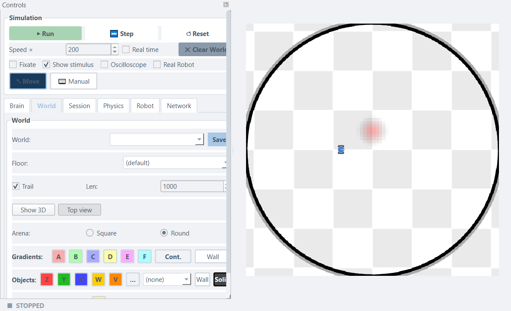
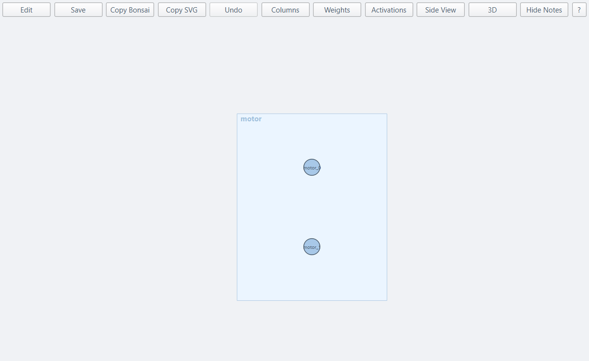
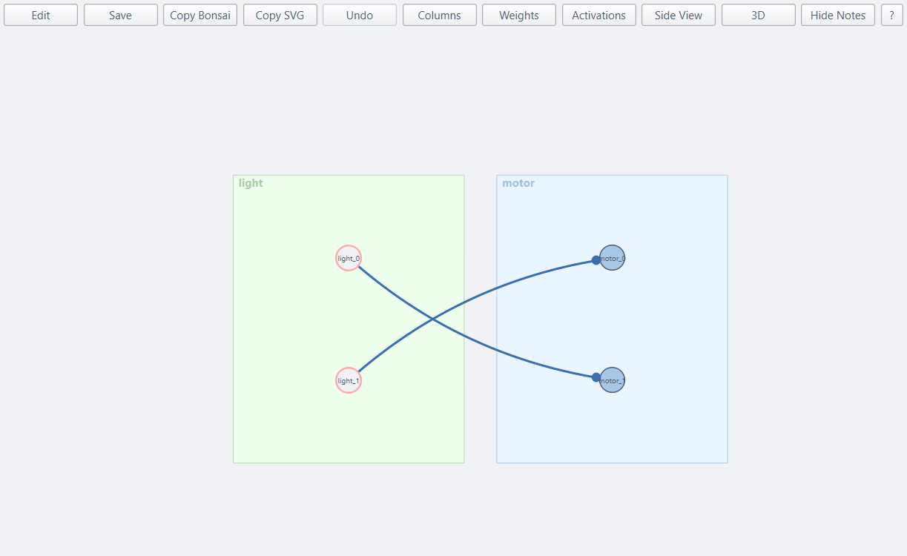
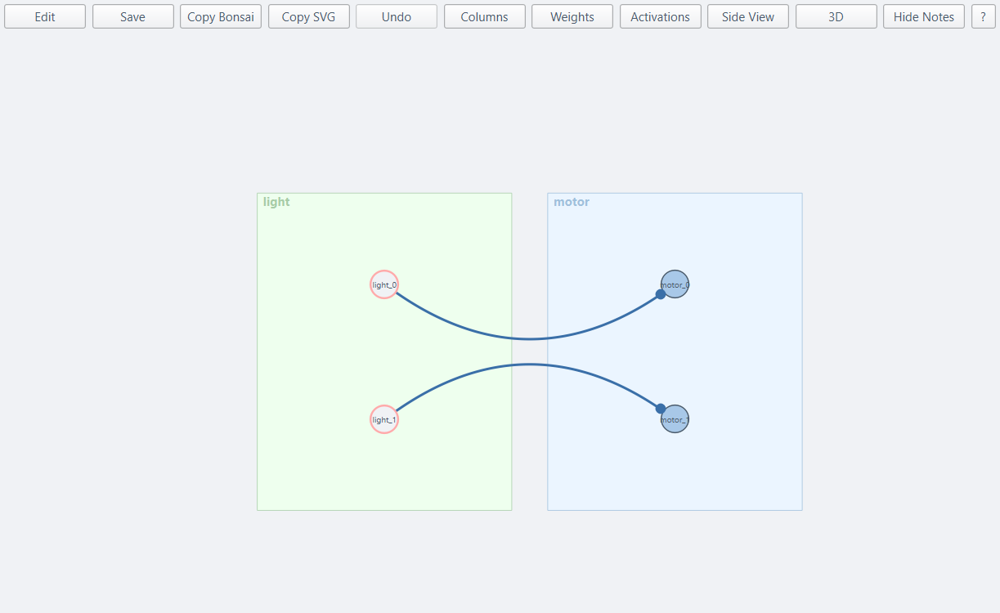

# Your First Braitenberg Vehicle

This tutorial builds a complete, working robot behaviour from scratch — world, sensors, and motor wiring — entirely through the simulator's **graphical network editor**. No Python file, no code.

You will discover how just two sensor neurons wired to two motor neurons can produce what looks like desire or fear, and how swapping two connection weights is all it takes to switch from one to the other.

**What you will build**

| Step | What happens |
|------|--------------|
| Place a gradient patch | The arena has a single red stimulus cloud |
| Wire attraction | Crossed connections — the robot steers toward the patch |
| Flip to avoidance | Swap two weights — the robot now flees the same patch |

---

## Background — Braitenberg's insight

In 1984, Valentino Braitenberg described a series of imaginary vehicles. Each had sensors on the front
and motors on the sides. He showed that incredibly simple wiring rules produce surprisingly rich behaviour:

- **Crossed wiring** (left sensor → right motor, right sensor → left motor): when the stimulus is
  stronger on the left, the *right* motor speeds up and the robot steers toward it — **attraction**.
- **Same-side wiring** (left sensor → left motor, right sensor → right motor): when the stimulus is
  stronger on the left, the *left* motor speeds up and the robot steers away — **avoidance**.

That is the whole secret. No computation, no memory, no planning — just which wire goes where.

---

## Step 1 — Launch the simulator

Open a terminal, go to `simulation/2d/`, and run:

```bash
python LBPSimulator.py
```

The main window opens. You will see a **Controls panel** on the left with a *Brain / World / Session / Physics / Robot / Network* tab bar, and the **arena** — the large circular area on the right — with the robot disc sitting near the centre.



---

## Step 2 — Place a gradient patch

A **gradient patch** is an invisible circular stimulus cloud. The robot's sensors detect its signal; the robot's body passes through it without resistance.

1. Click the **World** tab in the Controls panel.
2. In the *Gradients* row, click the **A** button (the pinkish-red one — it creates a gradient with label `A`).
3. Move your cursor onto the arena, somewhere **in front of the robot** — toward the upper half of the arena.
4. Click and drag: the drag *start* becomes the patch centre; the drag *end* sets its radius. Aim for roughly one-quarter of the arena in diameter.
5. Release the mouse. A faint red glow appears in the arena.



!!! tip "Too small or too large?"
    Right-click the patch to delete it and try again. Larger patches are easier for a first experiment.

---

## Step 3 — Open the network editor

The network editor is where you draw the circuit that connects sensors to motors.

1. Click the **Brain** tab.
2. Click the **Network** toggle (next to **Code brain**). In this mode the robot reads its wiring from a file you edit graphically.
3. Click **+** beside **Network** and give the new network a name — for example `Braitenberg`.
4. Click **⬡ Open visualizer**. The **Network Visualizer** window opens.

The canvas shows one node already: **`motor`**, the left and right wheel outputs (`motor_0`, `motor_1`). Everything your circuit builds feeds into this node.



---

## Step 4 — Add a light sensor

The robot will sense the gradient patch through a `GradientSensor` with two rays: one pointing slightly left (`light_0`) and one slightly right (`light_1`).

1. The chip palette is on the left edge of the visualizer (the **Palette** button shows / hides it).
2. Drag the **GradientSensor** chip onto the canvas, to the left of the `motor` node.
3. A dialog opens to configure the sensor. Set:
    - **name** → `light`
    - **n** → `2` (one ray per side — left and right)
    - **gradient** → `A` (so it responds to the red patch you placed)
    - **scale** → `60` (this amplifies the raw `[0,1]` reading to the `[-100, 100]` motor range)
4. Confirm. The `light` node appears on the canvas with two neuron circles (`light_0`, `light_1`).

---

## Step 5 — Wire for attraction

Now draw a connection from `light` to `motor`, and fill in the weight matrix that produces attraction.

1. Drag from the **`light`** node onto the **`motor`** node. A connection arc appears and the **weight matrix editor** opens immediately.
2. The editor shows a 2 × 2 grid. Rows are *target* neurons (motors), columns are *source* neurons (sensors):

    |  | `light_0` (left) | `light_1` (right) |
    |--|--|--|
    | `motor_0` (left wheel) | 0 | **1** |
    | `motor_1` (right wheel) | **1** | 0 |

3. Choose **Manual** mode, enter the values above, and confirm.

The canvas now shows two arcs that **cross** — `light_0` feeds `motor_1` and `light_1` feeds `motor_0`. That crossing is the wiring that produces attraction.



4. Click **Save** in the visualizer toolbar to save the network file.

---

## Step 6 — Run it

Close the visualizer (or leave it open beside the main window), then press **▶ Run** in the simulator.

Watch the robot. With the patch placed above it, the right sensor (`light_1`) detects more signal than the left sensor (`light_0`). Because `light_1` drives the left motor (`motor_0`), the left wheel goes faster and the robot curves right — toward the source. This is **Vehicle 2b**, attraction.

!!! note "Nothing happening?"
    Make sure the network was saved and the group is in **Network** mode with your file selected. If the robot circles without making progress, try increasing the patch size in the World tab.

---

## Step 7 — Flip to avoidance

Stop the simulation and change the connection weights to the same-side pattern.

1. In the network visualizer, right-click the arc between `light` and `motor` and choose **Edit weight…** (or click **Weights** in the toolbar to open the global weight matrix panel).
2. Switch the pattern to **One-to-one** — or, in Manual mode, change the matrix to:

    |  | `light_0` (left) | `light_1` (right) |
    |--|--|--|
    | `motor_0` (left wheel) | **1** | 0 |
    | `motor_1` (right wheel) | 0 | **1** |

3. Confirm and click **Save**.

The arcs no longer cross — `light_0` feeds `motor_0` and `light_1` feeds `motor_1`.



Press **▶ Run** again. The robot now **moves away** from the patch. When the patch is to the right, `light_1` fires, the right motor speeds up, and the robot curves left — away from the source. This is **Vehicle 2a**, avoidance.

---

## Step 8 — Experiment

**Blend the behaviours**

In the weight matrix, intermediate values produce intermediate behaviours. Try:

$$\mathbf{W} = \begin{pmatrix} 0.2 & 0.8 \\ 0.8 & 0.2 \end{pmatrix}$$

The off-diagonal entries (0.8) dominate, so the robot still trends toward the patch — but more hesitantly. Reverse the values (0.8 on the diagonal) for a robot that mostly avoids but occasionally drifts back.

**Adjust the sensor scale**

Right-click the `light` node → **Properties…** and change `scale`. A smaller scale means weaker motor commands and a slower, less decisive robot. A larger scale can cause over-steering and oscillation.

**Add a second patch and sensor**

In the World tab, click the **B** button (green) and place a second patch. In the network editor, add a second `GradientSensor` with `name=light2`, `gradient=B`, `scale=60`. Wire it to `motor` with the identity matrix (avoidance). Now the robot is attracted to red and repelled by green simultaneously.

**Save the session**

Click the **Session** tab → **Save** to snapshot both the world layout and the brain wiring. The file lands in **My files** (your files folder, `~/LBPSimulator/configs/` by default) and reloads exactly on the next run.

---

## What to try next

- **[Creating Worlds](../creating-worlds.md)** — all gradient, obstacle, and wall types in detail.
- **[Wiring Brains](../wiring-brains.md)** — Vehicle 3 (inhibition + constant drive), adding a `LeakyLayer` for smooth motor responses, and more wiring patterns.
- **[Coding Brains](../coding-brains.md)** — if you want to express the same circuits in Python code instead.
