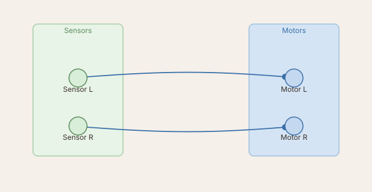
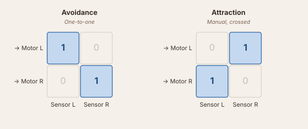
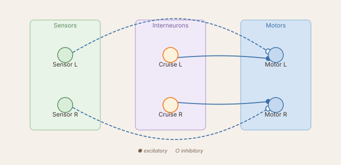
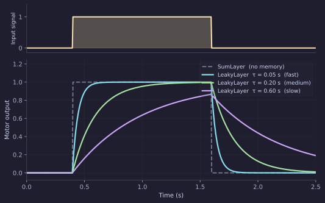

# Wiring Brains

In [Coding Brains](coding-brains.md) you built a Braitenberg vehicle by writing the sensor-to-motor mapping directly in `loop()`. That works perfectly, but there is a cost: the connection strengths are constants baked into your code. Changing them means editing, saving, and reloading the file.

This tutorial builds those vehicles — plus a third — entirely through the **Network visualizer's** graphical editor. No Python file, no `loop()`. Every connection is a weight matrix you draw and type into, and every edit takes effect immediately.

---

## Getting started

Select **`BrainGUI`** from the [Brain selector](tour.md#brain-selector). This is the brain file that enables the [Network visualizer](tour.md#network-viz)'s graphical interface — it's a `DataBrain`, the only brain that loads its circuit from a saved file instead of code.

Click **+ New network** and give it a name. This creates an empty circuit that already contains one node: `motor`, a `MotorLayer` with two outputs (left wheel, right wheel). Everything else below happens inside the visualizer.

---

## The circuit

Same robot as [Coding Brains](coding-brains.md): two light sensors, two wheel motors.

A sensor node feeding the `motor` node is the whole circuit — no summing layer needed in between. The pattern above (each sensor to its own-side motor) is the avoidance wiring you'll build next; crossing the connections instead gives attraction, covered further down.

---

## Adding the sensor

Open the Network visualizer and click **Edit** in the toolbar — a palette of sensor and layer chips appears. Drag **GradientSensor** onto the canvas, to the left of `motor`. A dialog opens to name and configure it: set `name` to `light` and leave `n=2` (one ray per side). Confirm to drop the node.

---

## Wiring it — avoidance

Click `motor` to select it, then drag from `light` onto `motor`. The **weight-matrix editor** opens the instant the connection is created — the same dialog you get later by right-clicking any existing connection and choosing **Edit weight…**.

The dialog labels its own axes: rows are `motor` neurons (target), columns are `light` neurons (source), `+` excitatory / `−` inhibitory. Pick the **One-to-one** pattern and leave its default amplitude of `1` — sensor 0 (left) now drives motor 0 (left) with weight 1, sensor 1 (right) drives motor 1 (right) the same way, and every other cell is zero.

`light`'s raw reading only ranges over `[0, 1]`, nowhere near the `[-100, 100]` range the robot expects. Rather than inflating the weight, scale the *source*: right-click `light` → **Properties…** and set `scale` to `60`. The sensor now reports up to `60`, the weight stays a clean `1`, and the motor gets the real command directly — no separate speed slider, no code.

!!! note "Or scale the connection instead"
    Scaling at the source isn't required — you could just as well leave `light`'s `scale` at `1` and set the connection's weight to `60` instead. The two are mathematically identical (`1 × 60 = 60 × 1`); scaling the sensor just keeps every downstream weight matrix in this tutorial a clean `±1`.

Run it: when light is on the left, the left motor speeds up and the robot steers right, away from the source. This is Vehicle 2a, **avoidance**.

---

## Attraction — cross the connection

Right-click the connection between `light` and `motor` → **Edit weight…**, switch the pattern to **Manual**, and swap the two nonzero cells: `1` in row 0 / column 1 and row 1 / column 0 instead, diagonal left at zero. Now the left sensor drives the *right* motor.

| Pattern | Meaning |
|---------|---------|
| One-to-one (diagonal) | Sensor L → Motor L, Sensor R → Motor R. **Avoidance.** |
| Manual, crossed | Sensor L → Motor R, Sensor R → Motor L. **Attraction.** |

One dialog, two cells swapped — completely opposite behaviour.

---

## Vehicle 3 — cruising with inhibition

Braitenberg's Vehicle 3 keeps the same body but changes two things: the sensor connection is **inhibitory** (a negative weight) instead of excitatory, and a `ConstantLayer` gives both motors a constant baseline drive so the robot cruises forward even with no stimulus at all.

Start another new network for this one. Drag a **GradientSensor** onto the canvas (`name='light'`, `n=2`, `scale=30`) and a **ConstantLayer** next to it, named `cruise` (`n=2`, `value=30`) — `ConstantLayer` has no separate scale factor, so `value` *is* the number that reaches the motor. Then wire both into `motor`:

- `cruise → motor`, **One-to-one**, default amplitude `1` — a steady forward baseline of `30` on both wheels.
- `light → motor`, **One-to-one**, amplitude `−1` — same-side, but inhibitory this time.

With the light on the left, the left sensor rises and *subtracts* from the left motor while the right motor holds at the cruise baseline — the relatively faster right motor turns the robot **toward** the light, decelerating as it gets closer (at full sensor strength the two cancel exactly: `30 − 30 = 0`, which is why `light`'s `scale` was set to match `cruise`'s `value`). Braitenberg called this behaviour **love**: the vehicle approaches and settles near the source instead of colliding with it.

Cross the inhibitory connection the same way you did for attraction (Manual, `−1` in the off-diagonal cells) and the turn flips sign: the robot steers away from the light while still cruising forward, rather than the instantaneous swerve of the plain avoidance circuit.

---

## Adding memory — the LeakyLayer

A `MotorLayer` passes its input through instantaneously. The motor jumps to full speed the moment the sensor fires, and drops to zero the moment the source moves away. Real muscles — and real motor controllers — don't work like that.

A `LeakyLayer` is a first-order low-pass filter. Its output approaches the input with time constant `tau_rise` and decays with `tau_decay`:

$$
\tau \, \dot{x} = -x + u, \quad \text{output} = \max(0,\, x)
$$

Larger `tau` → slower, smoother response. The motor no longer chatters when the robot skims the edge of a patch.

Back in the avoidance/attraction network, right-click the `light → motor` connection → **Remove**. Drag a **LeakyLayer** chip onto the canvas between them, name it `smooth`, and leave `n=2`. Rewire the circuit:

- `light → smooth`, **One-to-one**, default amplitude `1`.
- `smooth → motor`, **Manual**, `1` in the crossed cells (attraction, this time filtered).

`light`'s `scale` is still `60` from before, so it carries straight through — every weight here can stay a clean `±1`.

Right-click `smooth` → **Properties…** to set `tau_rise` and `tau_decay` — try `0.15` for both. `tau_rise`/`tau_decay` are in seconds, applied at the simulation's `dt` (default 20 ms): `tau = 0.15` means the output reaches ~63% of a step input after about eight simulation ticks. Change either value while the brain is running and the response speed changes immediately.

---

## What to try next

- Drag a second `LeakyLayer` between `smooth` and `motor`, set its activation to `relu` in **Properties…**, and observe how the threshold changes the robot's sensitivity near the edge of a patch.
- Drag an `AdaptiveLayer` chip (`w > 0`, `n=2`) — it oscillates autonomously (half-centre oscillator). Wire a light sensor into it and watch the oscillation frequency change with stimulus intensity.
- Once you have a circuit you like, use **Copy Bonsai** to export the network to a LBP.Torch workflow and run it on the real robot.
- Make the robot's response context-dependent with [Neuromodulators](neuromodulators.md).
